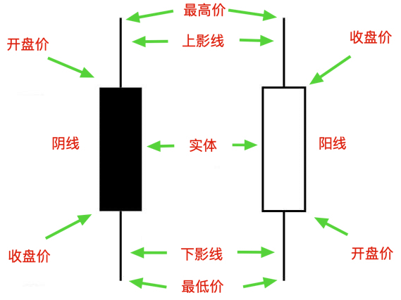

# 第一章：基础知识之K线篇

## 什么是K线

你在K线图看到的一个个小长方块就是K线。

上图中就有两根K线，左边叫阴线，右边叫阳线。二者的区别也很明显，阴线的收盘价在开盘价的下方，阳线的收盘价在开盘价的上方。

## K线上各个部位的含义

上影线：买方力量小于卖方力量。

> 你细想一下，买方推动价格的上涨，结果遇到了更强力量的卖方，价格自然就会回落，这就是上影线形成的过程。

下影线：买方力量大于卖方力量。

> 你细想一下，卖方推动价格的下跌，结果遇到了更强力量的买方，价格自然就会上涨，这就是下影线形成的过程。

实体：买方或卖方的投降。

> 你细想一下，在一个实体的内部，无论阴线还是阳线，一定是一方的力量远大于另一才能形成实体。

## K线的变形

光头光脚阳线

> 没有上下影线或者上下影线都很短，代表着买方力量远远大于卖方，买方没有经过争夺便战胜了卖方。

光头光脚阴线

> 没有上下影线或者上下影线都很短，代表着买方力量远远小于卖方，卖方没有经过争夺便战胜了买方。

实体很短，上下影响也很短或者没有上下影线

> 出现这K线，往往意味着多空双方都没有交易的意愿，市场低迷。

实体很短，上下影响都很长

> 说明上有压力，下有支撑，买卖双方力量相差无几，交投意愿强烈，有洗盘嫌疑。

实体很短，上影线很长

> 说明卖方力量远远大于买方。

实体很短，下影线很长

> 说明买方力量远远大于卖方。

## K线形状与所处位置的关系

只谈K线不谈位置，则K线的意义将变得微乎其微。

