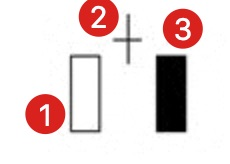
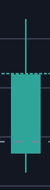
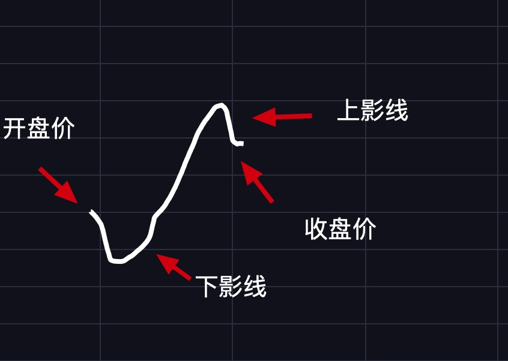

# 第一章：基础知识之K线篇

## 什么是K线

你在K线图看到的一个个小长方块就是K线。

上图中就有两根K线，左边叫阴线，右边叫阳线。二者的区别也很明显，阴线的收盘价在开盘价的下方，阳线的收盘价在开盘价的上方。

## K线上各个部位的含义

上影线：买方力量小于卖方力量。

> 想象一下，买方推动价格的上涨，结果遇到了更强力量的卖方，价格自然就会回落，这就是上影线形成的过程。

下影线：买方力量大于卖方力量。

> 想象一下，卖方推动价格的下跌，结果遇到了更强力量的买方，价格自然就会上涨，这就是下影线形成的过程。

实体：买方或卖方的投降。

> 想象一下，在一个实体的内部，无论阴线还是阳线，一定是一方的力量远大于另一才能形成实体。

## K线的变形

光头光脚阳线

> 没有上下影线或者上下影线都很短，代表着买方力量远远大于卖方，买方没有经过争夺便战胜了卖方。

光头光脚阴线

> 没有上下影线或者上下影线都很短，代表着买方力量远远小于卖方，卖方没有经过争夺便战胜了买方。

实体很短，上下影响也很短或者没有上下影线

> 出现这K线，往往意味着买卖双方都没有交易的意愿，市场低迷。

实体很短，上下影响都很长

> 说明上有压力，下有支撑，买卖双方力量相差无几，交投意愿强烈，有洗盘嫌疑。

实体很短，上影线很长

> 说明卖方力量远远大于买方。

实体很短，下影线很长

> 说明买方力量远远大于卖方。

## K线形状与所处位置

只谈K线不谈位置，则K线的意义将变得微乎其微。

* 上升趋势中遇到上影线，说明上升趋势可能会减弱或停止。

> 想象一下，在上升趋势中，上方遇到了足够大的卖方力量，买方力量无法战胜卖方力量时，就会留下上影线，上升趋势也有可能被改变。

* 上升趋势中遇到下影线，说明上升趋势可能会减弱或停止。

> 想象一下，在上升趋势中，上方遇到了足够大的卖方力量，价格下跌，这时候买方也增加了力量，价格再次上涨，就会留下下影线，虽然这时候买方力量仍然大于卖方力量，同时也说明卖方可能会继续蓄力，再次阻碍上升趋势。

需要注意的是：

1. 下降趋势同上升趋势，只要出现上下影线，择说明趋势可能会被改变。
2. 判断K线是否影响趋势时，一定要考虑到量能情况，这点在后面的量价关系中会讲到。

## K线组合

单根K线无意义，只有组合起来才有意义。

上由三根K线组成，我们假设此组合出现在一段上升趋中，那么接下来会怎么走呢？

说明上升趋势大概率要停止了，后面很可能下跌。

想象一下，

## K线的分形

现在我问你，一根K线能否做为一段趋势呢？你可能会想，一根K线怎么能做为一段趋势呢！

如果考虑时间周期，当然是可以的！

上图是一根1小时的K线，下图是我画的一段趋势。

想象一下，这是不是上面1小时K线的一种可能的走势，其实这就是分形！

#### 为什么要理解分形？

有了分形的概念，就更能理解K线的含义，每一根K线都代表着更小级别的一段走势，我认为这才是K线真正的含义。

