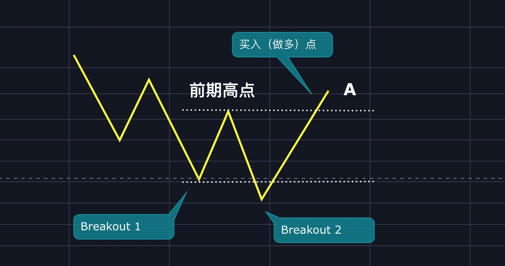
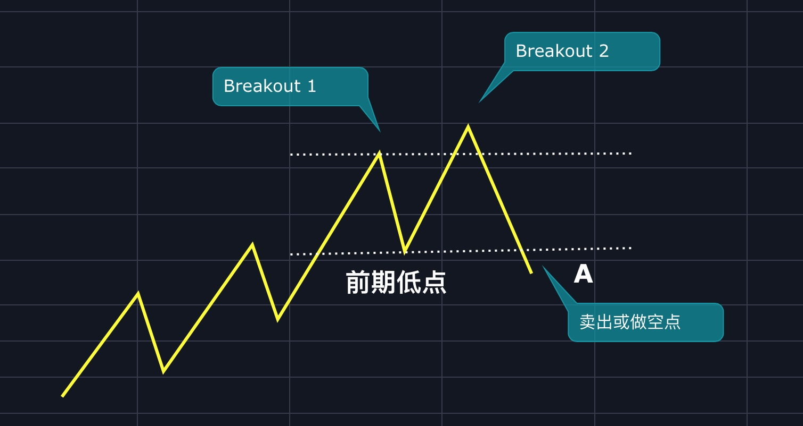

# 第十章：高级技术之2B法则

在《[第二章：基础知识之趋势线篇](qushixian.md#123-fa-ze)》一文中，我讲到了一个胜率很高的方法——123法则。

今天咱们来学习一下123法则的变种——2B形态。

2B中的B就是Breakout，中文突破的意思，2B就是突破了2次。

## 2B形态之W底或M顶的一种

上图中有两个突破Breakout 1和Breakout 2，其中Breakout 2在跌破Breakout 1后马上掉头向上，又在A点突破前期高点，如果这时候出现增量，则A点就是买入（做多）点。

上图中有两个突破Breakout 1和Breakout 2，其中Breakout 2在突破Breakout 1后马上掉头向下，又在A点跌破前期低点，如果这时候出现增量，则A点就是买入（做多）点。

## 2B形态之弹簧

## 2B形态之衰竭性2B

