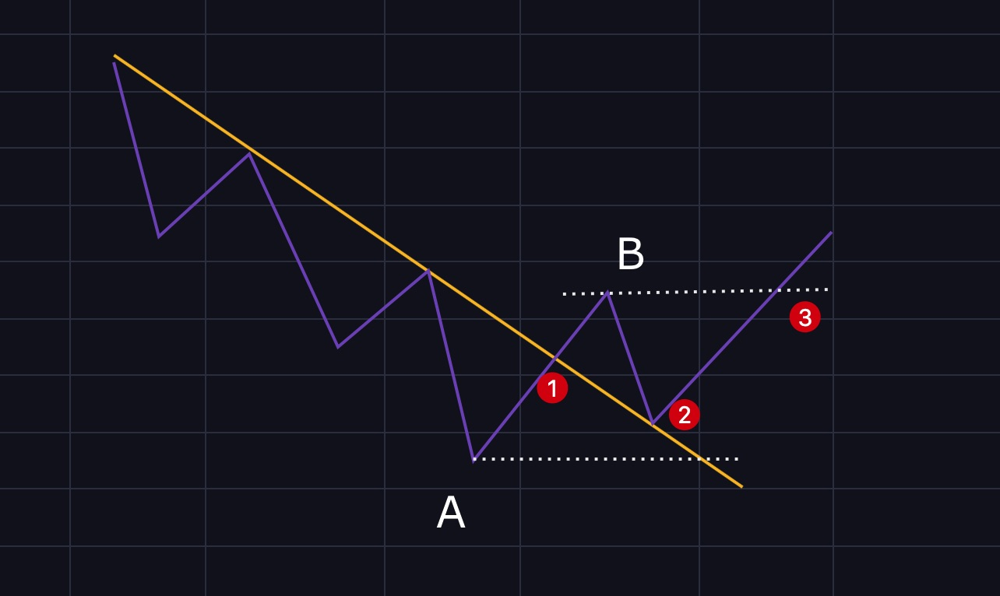
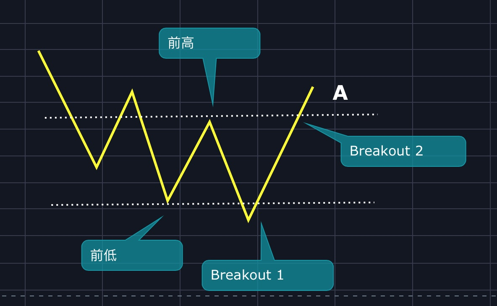
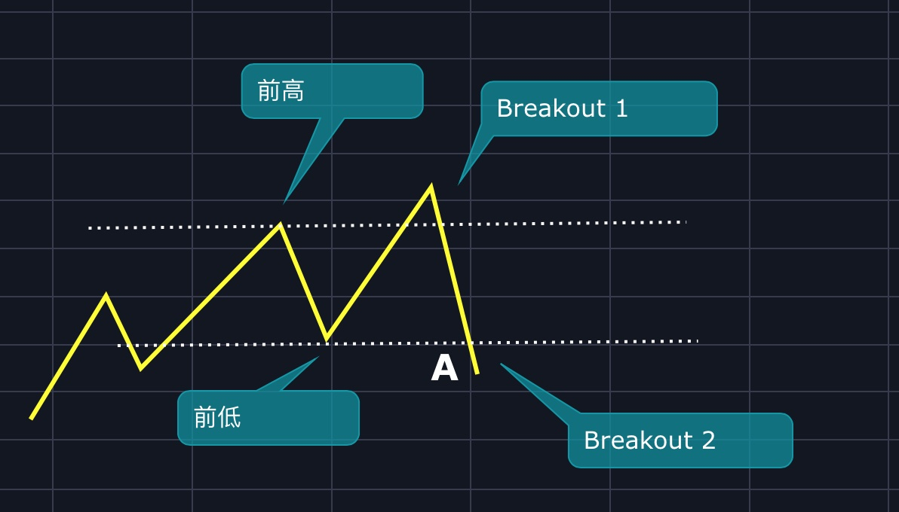
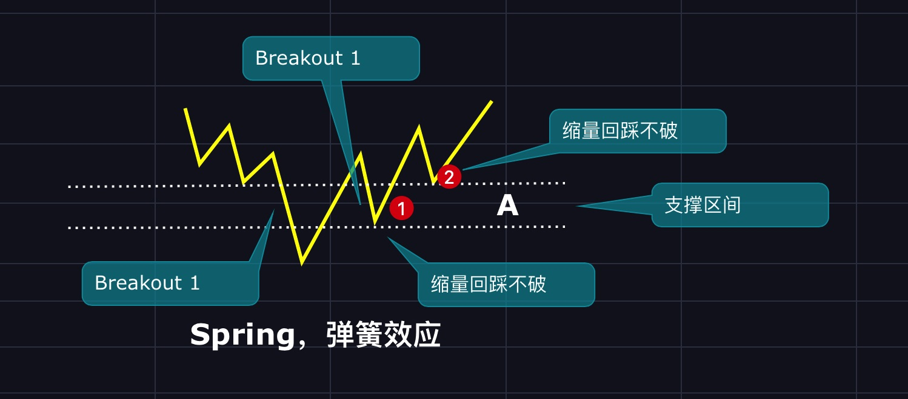
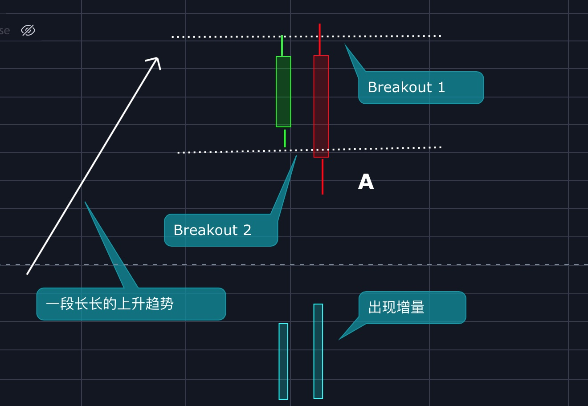
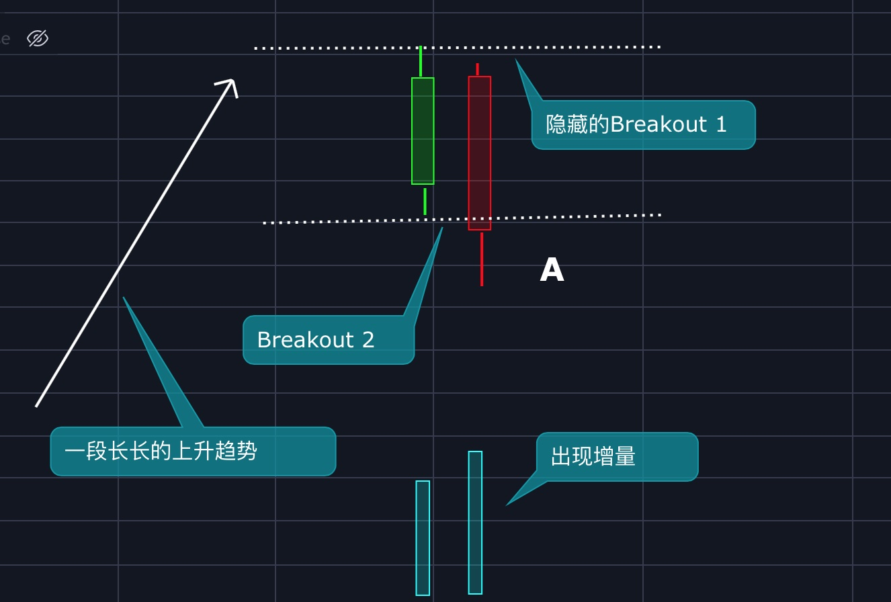
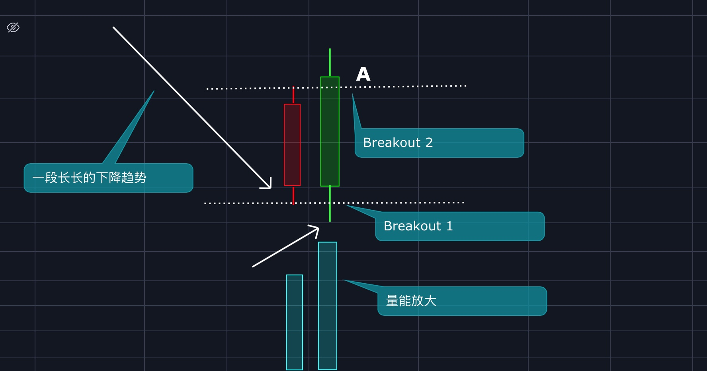
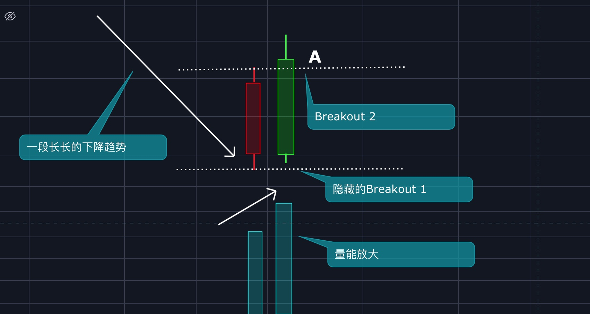

# 第十章：高级技术之2B法则

在《[第二章：基础知识之趋势线篇](qushixian.md#123-fa-ze)》一文中，我讲到了一个胜率很高的方法——123法则。

今天咱们来学习一下123法则的变种——2B形态。

2B中的B就是Breakout，中文突破的意思，2B就是突破了2次。

## 2B形态之W底或M顶的一种

上图中，Breakout 1是跌破前低，Breakout 2是突破前高，如果这时候出现增量，则A点就是买入（做多）点。

上图中，Breakout 1是突破前高，Breakout 2是跌破前低，如果这时候出现增量，则A点就是卖出（做空）点。

## 2B形态之弹簧

在《[第九章：高级技术之跟庄操作](gen-zhuang-cao-zuo.md#xi-chou-jie-duan)》一文中，我们在吸筹阶段讲到了弹簧效应这一概念，我们来复习一下。

在吸筹阶段的后半段，价格跌破震荡区间的下方支撑区间，发生一次向下突破，然后又快速拉回来，发生一次向上突破，如果后面有回踩支撑区间上下沿的机会，那么就是最佳入场点。上图中①、②就是买入点。

## 2B形态之衰竭型2B

衰竭型2B是本文的重点。

### 定义

在一段长长的上涨或下跌趋势中，如果出现两根K线，后一根K线突破前一根的高点或低点后，又迅速被拉回来，并且此时有量能的配合，那么趋势大概率会反转，这就是衰竭型2B的定义。

上图中，是一段长长的上升趋势，后一根K线突破前一根K线的高点后又立刻跌破前低，量能大增，说明上升趋势大概率会被终结，那么A点就是卖出（做空）点。

上图也是衰竭型2B，虽然第二根线没有突破前高，但其实这里是一个隐藏的突破，用不同的时间周期看就明了。

上图中，是一段长长的下降趋势，后一根K线跌破前一根K线的低点后又立刻被拉回突破前高，量能大增，说明下降趋势大概率会被终结，那么A点就是买入（做多）点。

上图也是衰竭型2B，虽然第二根线没有跌破前低，但其实这里是一个隐藏的突破，用不同的时间周期看就明了。

判断是不是衰竭型2B，一定要注意以下条件：

1. 是不是在一段长长的上升或下降趋势中。
2. 有没有立刻被拉回，也就第二根K线有没有成功发生二次突破。
3. 有没有量能的配合。

### 衰竭型2B的本质

上升趋势中的衰竭型2B：需求被耗尽，供应获主导地位。

下降趋势中的衰竭型2B：供应被耗尽，需求获主导地位。

