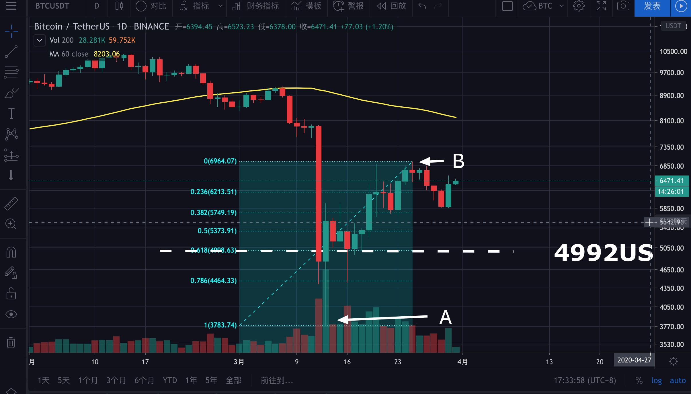

# 第四章：基础知识之Fib篇

在开始今天的内容之前，先来看下面一段话：

> 如果连6600都突破不了，那又会回到阴跌的走势中，下方支撑6200、5800，再往下就是5200-5400支撑区间。这里有一个地方比较关键，那就是5000点附近，如果跌破了这里，那就会回到4800、4400、3800，也就是我们期待的二次探底行情。

这是我在《3月30日晚间分析》中说的话，其中有个重要的点5000，如跌破这里，自3800以来的反弹就会结束，那么这个5000是怎么来了呢？

要想搞清楚，就要先来认识一下今天的主角：斐波那契回撤。

要理解斐波那回撤，就得先来了解斐波那契这个人。

## 斐波那契

> 比萨的列奥纳多，又称斐波那契（Leonardo Pisano ,Fibonacci, Leonardo Bigollo，1175年-1250年），，中世纪意大利数学家，是西方第一个研究斐波那契数的人，并将现代书写数和乘数的位值表示法系统引入欧洲。其写于1202年的著作《计算之书》中包涵了许多希腊、埃及、阿拉伯、印度、甚至是中国数学相关内容。

以上内容来自《百度百科》。

你看，老斐可是个大牛，他发现了一组有趣的数列，就是下面的斐波那契数列。

## 斐波那契数列

现在你知道了，0，1，1，2，3，5，8，13，21，34，55，89，144……这就是斐波那契数列，那么这组数列什么特点呢？

1. 前两项之和，正好等于后一个数。
2. 越靠后，两个连续的“斐波纳契数”相除，其结果越接近1.618或0.618，比如 $$144/89=1.61797753$$ ， $$89/144=0.61805556$$ 

因此，斐波那契数列又叫黄金分割数列，这组数列在生活中有着广泛的应用，其中就有运用在技术分析上的斐波那契回撤水平。

## 斐波那契回撤

对于斐波纳契回撤，你只需要知道，它是用来判断在一段走势中，回调或反弹时可能会遇到的支撑或压力位的，其他的不需要管。

上图中，a——b是一段上升趋势，现在行情从b处开始回落，那就有一下几种可能：

1. 回调至①点（0.236），然后转头向上；
2. 回调至②点（0.382），然后转头向上；
3. 回调至③点（0.5），然后转头向上；
4. 回调至④点（0.618），然后转头向上；
5. 跌破⑤点，说明从a点到b点的上升趋势结束，后市有回到和跌破a点的可能。

以上，就是斐波那契回撤的用法，下面我再解释一遍。

1. 在①处获得支撑的情况有没有呢？有，但是不常见，因此建议大家直接忽略0.236（23.6%）处的支撑。
2. 在②获得支撑的情况通常发生在强势行情中，因此0.382（38.2%）处通常是一个重要的支撑与压力位。
3. 在③处获得支撑，也很常见，因此③处也是一个重要的支撑，但若跌破③处，则说明趋势已经变弱。
4. 在④获得支撑说明原来的趋势没有不改变，不也是最后的一个支撑，若跌破，则预示着原来的趋势结束。
5. 在平时的操作中，你只要记住38.2%、50%与61.8%这三个位置即可。

### 知识点

> 在38.2%支撑住，说明行情很强势；在50%支撑住，说明行情虽不强势但也尚可；在618%支撑住则说明趋势未被逆转；跌破618%，原趋势结束。

## 小技巧

* fib可用于对结构及趋势是否逆转的判断，
* 上升趋势中找可能的回调目标（支撑位），从最低点向最高点画。
* 下降趋势中找可能的反弹目标（压力位），从最高点向最低点画。
* 交易量小的币无效，BTC与ETH等主流币可以使用。
* 通过fib得出的支撑与压力位要与通过其他方法得出的压力与支撑位相结合。

**最后，我为什么说跌破5000点反弹趋势就结束了？**

我们从A（3800低点）到B（6957高点）做一条fib，61.8%处的价格是4992，也就是5000附近，因此，如果跌破5000，则反弹趋势结束。

