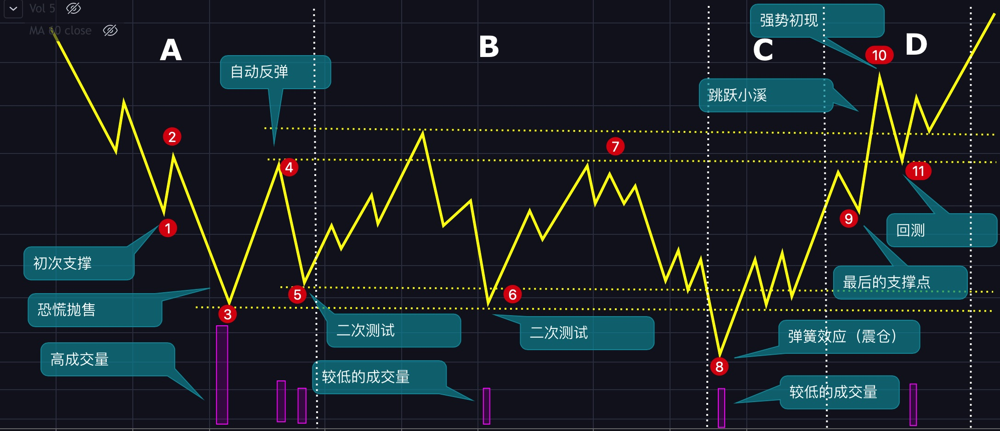
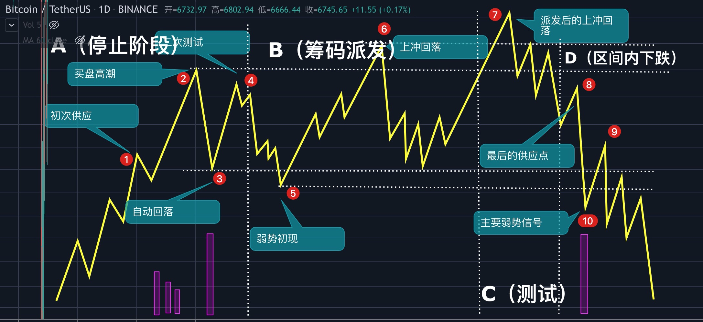

# 第九章：高级技术之跟庄操作

上一章中，我们了解了韭菜是如何被收割的，这一章呢，我们来做一次主力。首先来思考一下这个问题：

**如果你是主力，你该怎么割韭菜呢？**

## 威科夫简介

理查德·D·威科夫（Richard Demille Wyckoff，1873年11月2日-1934年3月7日）是20世纪初技术分析领域的大牛，与查尔斯·道、威廉江恩、艾略特齐名，威科夫对量价关系的研究有着独到和深刻的见解，在几个量价分析方法中，威科夫的方法最系统、最完善，在实战中最容易使用，可以说，威科夫的方法是最接近主力的一种分析方法，只是在我国威科夫分析法没有道氏理论、波浪理论等使用的人多而已。

## 威科夫交易法

威科夫交易法其实就我们常说的跟庄交易，主力（庄家）买入时咱开始买，主力卖出时咱开始卖，主力骗炮时咱不上当。

听起来是不是很酷？那下面就一起来学习吧。

**威科夫三大原理**

1. **供需原理：**价格的涨跌由供应与需求决定**，**当供应小于需求时，价格就会上涨；当供应大于需求时，价格就会下跌。
2. **因果原理**：BTC之所以会拉升，其原因是主力在底部够了筹码，如果没有吸筹就拉升，那行情通常走不远，我们平时说的筑底是一个长期的过程就是这个原因。
3. **投入与产出原理**：这里主要说的是交易量与币价要匹配，如果币价一直在拉升，成交量却在减低，那就说明主力可能可能在出货，如果价格在下跌，交易量也在下跌，那就说明主力在震仓。也就是说，投入（成交量）要与产出（价格）相匹配，不匹配就说明趋势要转变了。

**优点与缺点**

> 优点：威科夫交易法最系统、最完善、最容易实战。
>
> 缺点：太主观了，比如有时候主力不是吸筹，但仍可以吸筹解释。

### 吸筹阶段

①：**初次支撑：**初次支撑通常发生在一段长长的下跌之后，主力认为跌的差不多了（通常是从价值投资的角度考虑的），就会进场接货，这时候就会对价格起到一个支撑作用，但这个支撑通是会失败的，价格随后会创出新低。

③：**恐慌抛售：从**②到③是恐慌抛售，这一阶段的特点是在段时间内大幅下跌，交易量剧增，大量散户被吓得割肉离场，主力就会趁机接货，表现在K线图上就是留下一根长长的下影线。

④：**自动反弹**：卖盘被耗尽后，价格在很少买盘的推动下就可以上涨，随后的空头平仓继续推动价格上涨，通常会形成长期下跌以来最大幅度的反弹，反弹的高点会成为主力吸筹区间的上沿，这一阶段成交量的特点是缩量，不会特别大。

⑤：**二次测试**：由于主力还没有吸筹完成，价格还会回到震荡区间，随着价格接近前低，这时候的成交量应该是逐渐减少的，最后价格在前低上方停止下跌，这就是**二次测试**。需要注意的是，如果价格回落，交易量却在上升，说明供应依然会多，那么主力就会进行多次的测试，我们可以叫三次测试、四次测试（但在威科夫交易法中都叫二次测试），直到不再出现大量的供应。

**①-⑤就是阶段A，这一阶段的主要目的是让价格停止不再下跌，为后面的吸筹做准备。**

⑥：**二次测试：**继续二次测试，但这时候，主力就开始吸筹了，当然，这一过程中主力也可能会通过在区间底部买入在顶部⑦卖出方式来摊薄成本。

**我们称⑤-⑦为阶段B，这一阶段的主要目的是吸筹。**

⑧：**弹簧效应：**弹簧效应通常发生在底部吸筹期的2/3处，主力在拉升之前会让价格跌破底部的支撑，如果跌破支撑时的供应很少（成交量很低），就说明市场上的供应真的没有了，可以拉盘了。如果这里的供应很大（高成交量），那么就说明主力吸筹失败，价格将继续走低。如果这里的供应中等，那么主力也会放弃拉盘的计划，继续震荡吸筹，直到出现成功的弹簧。**弹簧效应也就是我们平时说的震仓。**

⑨**最后的支撑点**：经过弹簧⑧的测试后，主力认为拉盘的时机成熟了，就会将价格拉升至区间的顶部压力区附近，注意了，马上要跳过压力区了，但这时候往往会有一个回测，如果价格能在较高的位置停止下跌且成交量也在减少，那么拉盘的条件就全部具备了。想象一下，当你要跳过一条小溪时，是不是先要后退几步，然后在快速小跑的跳过去，其实这里的回测也是一样的道理，前面的弹簧耗费了主力很多体力，现在遇到阻力了，后退几步再跳会安全很多。

**⑧-⑨构成了阶段C，阶段C的目的就是进行测试，看看现在能不能拉盘。而对于散户而言，阶段C就可以进场了。**

⑩**强势初现：**强势初现的表现是增量大阳线，价格也会突破阻力区间，突破阻力区的现象在威科夫交易法中叫跳跃小溪，这是需求完全控制市场的表现。它的出现给我们带来潜在的交易机会，也就是后面的回测突破点。一般发生在吸筹结束的时候，也会发生在区间交易结束的时候。

⑪**回测：**强势初现之后，价格会回落至下方支撑，如果这时候的交易量没有放大，那么就是无供应回测。**无供应回测是我们的最佳入场点。**

注意：以上是完美的底部吸筹过程，在真正的交易中，像二次测试、弹簧效应、强势初现、跳跃小溪等可能会多次初现，这里的关键是看市场上的供应与需求有没有彻底转换，如供应没有衰竭，则会进行多次的测试与震仓。

### 派发阶段

> 在牛市高潮，主力往往会配合媒体将散户的情绪调动起来，大家对前景一致看好，争先恐后的往里冲，往往这时，就到了主力派发的阶段。

①**初次供应**：在一段长期上涨后，大量的买盘被消耗，卖盘越来越多，阻止价格继续上涨，这时候主力也开始出货了，价格稍稍回落，但最终并未阻止价格的上涨（散户已经被媒体煽动起来了）。此时的表现是成交量增大，价格剧烈波动（上下插针）。很多时候的初次供应并不明显，有时候也只是发生在日内，比如在小时线上出现一根伴随着巨量的带有长长上影线的K线。

②**买盘高潮**：这时候大量散户仍然选择买入，主力借机将手中筹码卖出。图上的表现是巨量，价格波动巨大。

③**自动回落**：随着买盘被消耗以及主力大量的卖盘压力，价格开始大幅下跌，这次下跌的低点我们视为派发区间的支撑位。

**①-③是阶段A，其作用是让价格停止不再上涨。**

⑤**弱势初现**：从④到⑤，供应一直在控制着局面，行情开始下跌，跌破前期低点的支撑位。这一阶段的特点是价格下跌幅度大，成交量持续放大，一般发生在派发阶段或者区间交易尾部，它是派发结束或者区间交易结束的标志，它的出现后给我们提供了潜在的交易机会，我们可以在之后的上冲回落后做空。通常这时候，主力会在⑤附近也进行买入，因为主力还有很多筹码没有出手，他们不想价格跌的太低。这时候散户仍然认为这是牛市，也会在低点大量买入。

⑥**上冲回落：**上冲回落的特点是交易量巨量，价格突破前提高点但是会很快回落，在K线图上是一根长长的上影线。这是主力在测试上方还有没有需求，也是我们逃顶的重要信号。其实上冲回落还有其他的目的，那就是爆掉早期的空单以及引诱趋势交易者（突破追）做多。

**⑤-⑥是阶段B，主要作用是威科夫三大原理之一因果原理中的因，也就是主力在派发，只有主力进行了派发，后面才会进入下跌趋势。**

⑦：**派发后的上冲回落**：派发现象出现之后的上冲回落，一般发生在高位，类似于吸筹阶段的弹簧，这是对市场最后的测试，意图让最后一波买家冲进去，同时让入场的空头止损。主力这样做的目的是准备让价格下跌，但是不让散户看出来，反而给散户的感觉是价格要向上突破。

**⑦是阶段C，作用是对市场的需求进一步做测试，若上方暂无需求，那么会进入下一阶段。**

⑧和⑨是**最后的供应点：**当供应完全控制市场之后，主力需要确认需求已经枯竭，也是主力最后派发的地方。

⑩以后的下跌往往会伴随着大交易量，市场正式进入下行趋势。

注意：以上是完美的顶部派发过程，在真正的交易中，像上冲回落、弱势信号等可能会多次初现，这里的关键是看市场上的供应与需求有没有彻底转换，如需求没有衰竭，则会进行多次的测试与上冲回落。

## 主力

学完上面的内容，现在你对威科夫交易法有一定的了解了，但你有没有想过，威科夫交易法中提到的主力究竟是谁？为了收割散户，主力又通常会用哪些不为人知的手段呢？

### 主力是谁

我们通常所说的主力，一般有下面这几类。

* CM，这是威科夫交易法中对主力的描述，中文翻译为**市场综合人。**CM的概念有点不容易理解，你可以将它看作一个集合，这个集合所形成的合力始终能与市场的方向一致。我给你举个例子吧，还记得3月13日那天吗？BTC跌至3800点。如果你在3800进行了抄底，那么当时的你就是CM的一部分，因为市场在你与其他人的合力抄底下停止下跌了（市场方向与你操作的方向一致）。相反，如果你在3800做空，你就不属于CM。
* 大机构。大机构拥有大资金，能轻而易举地影响市场方向。
* 交易所。在币圈，交易所处于食物链最顶端，它对市场的影响虽然没有CM以及大机构对市场的影响大，但交易所知道散户的仓位、止损价格与爆仓价格，因此，交易所能轻而易举的收割散户。短时间快涨快跌、定点爆仓多为交易所所为。

### 主力的特点

* 资金量大，目的性强，可以对行情的方向起到决定性作用。
* 主力不止一个，谁实力强，谁就夺得了市场的控制权。

### 主力常用的伎俩

①**链上大额转账**：当出现从某钱包转出10000个BTC到某交易所的消息时，有四种情况发生。一是真的要砸盘了。二是交易所内部钱包转账。三是真的要砸盘， 但小白村长被主力用“交易所冷钱包间转账”的假消息忽悠而最终被套。四是不会砸盘，本来是交易所内部转账或者主力自己转账，但村长被主力用“大额转账到某交易所，要砸盘了”的消息恐吓而丢掉筹码。如何破？如果你有分辨转账地址的能力，那你自己去求证，如果你不会看地址，那就干脆不要看链上转账的消息。

②**高位多次拉盘却没有突破前高**：给人一种牛市要继续的感觉，营造多头氛围，掩护主力出货。

③**跌破关键支撑后横盘**：吸筹、 震仓或诱空。

④**插针**：故意向上插针，让散户误认为上方压力重重，上不去，散户就很容易在这里卖出或做空，结果主力接过了村长的筹码后一顿暴拉，散户吐血。另外一种情况是行情真的要下跌，但这时候车太重，我需要向上插一根针来爆掉一部分空头，车轻才好砸盘。故意向下插针也是同样道理。另外，交易所通过插针的方式可以轻而易举地爆掉用户的合约或者将用户的合约单打止损。

⑤**大额压单与托单**：盘口上常常会显示大额的压单或托单，这是新手最容易上当的地方，比如BTC现在的价格是7000点，这时候在7200处出现了1000个BTC的卖单，新手一看，上面有个这么大的卖单，不行，行情肯定涨不上去，我得赶紧卖出，于是新手就卖出了。可这时候行情不跌反涨，当即将上涨至7200的时候，这个大额卖单突然消失了，紧接着又在7300的地方出现一个大额的卖单……这就是通过压单的方式让散户卖出，主力趁机吸筹的伎俩。你看，主力就这样略施小技就将散户的筹码换手了。托单的情况亦是如此。那么如何判断大额挂单是否真正的想要成交呢？你就看价格到达这里时，这个挂单是被逐渐吃掉还是突然消失后又在其他地方出现，如果出现后者的情况，那么大概率是故意压单或托单。

⑥**固定时间段中的例外**：一般情况下，BTC都会在每周、每天的一个固定时间涨或跌，等散户养成了这种固定思维后，主力就会突然发起攻击。比如大家都认为在周末没有行情，但隔几周就会发生一次例外，这种由主力刻意造出来的不确定性也是金融市场的不确定性之一。

⑦**碾空与套多**：行情持续小碎步上涨，明明该回调了也不回调，这时候大部分的空头都不会平仓，而会选择继续加仓或者抗单，最后往往被深套或爆仓，这就是碾空。行情小碎步下跌，速度不快但中间没有反弹，多头亦会补仓或者抗单，最后往往被深套或爆仓，这就是套多。碾空与套多虽然不常见，但绝对会发生。

### 如何应对

现在我们知道了主力的一些常用伎俩，那么你有没有想过，主流为何要处心积虑地“忽悠”我们散户呢？当然是赚钱，但如果看的更细一点，你就会发现，主力的目的有三——吸筹、洗盘与出货（威科夫里面叫派发）。如果我们能轻易分辨出来主力的这些目的，那就不会再上当了。

#### 吸筹

观察一段时间内有没有主力吸筹，就看在这段时间内有没有缩量的行为，比如缩量下跌、缩量拉升等，因为放量可以造假，但缩量永远造不了假，不经过地量阶段的底部不是真正的底部。

#### 洗盘

币价大幅震荡，大起大落的，趋势不明朗；上涨放量下跌缩量；价格跌破重要支撑位后不再继续下跌。

#### 出货

多次拉升不破前高，缩量拉升放量下跌。

### 主力可以控制技术指标，精准狙杀技术交易者

均线金叉死叉，MACD金叉死叉，RSI顶背离与底背离等等，以上的每一个指标都可以被主力完美的控制，所以你可能会经常听人说指标不准的之类的言论，但真的是这样的吗？

**是的，单一指标经常失灵。**

那如何破解呢？

破解办法也很简单，就是多个指标配合使用，具体用法将会在后面的章节详细讲解。

