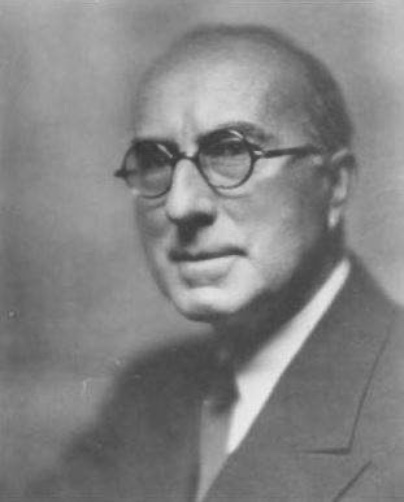
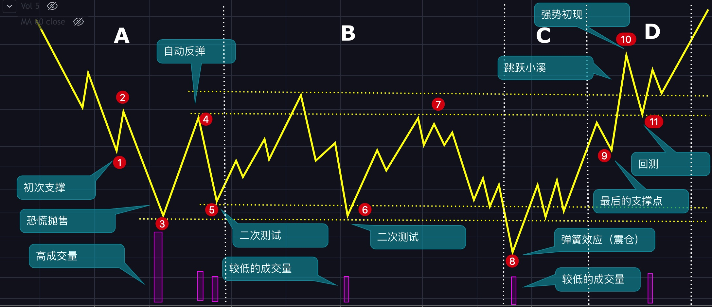

# 第九章：高级技术之跟庄原理

上一章中，我们了解了韭菜是如何被收割的，这一章呢，我们来做一次主力。首先来思考一下这个问题：

**如果你是主力，你该怎么割韭菜呢？**

## 威科夫简介

理查德·D·威科夫（Richard Demille Wyckoff，1873年11月2日-1934年3月7日）是20世纪初技术分析领域的大牛，与查尔斯·道、威廉江恩、艾略特齐名，威科夫对量价关系的研究有着独到和深刻的见解，在几个量价分析方法中，威科夫的方法最系统、最完善，在实战中最容易使用，可以说，威科夫的方法是最接近主力的一种分析方法，只是在我国威科夫分析法没有道氏理论、波浪理论等使用的人多而已。

## 威科夫交易法

威科夫交易法其实就我们常说的跟庄交易，主力（庄家）买入时咱开始买，主力卖出时咱开始卖，主力骗炮时咱不上当。

听起来是不是很酷？那下面就一起来学习吧。

**威科夫三大原理**

1. **供需原理：**价格的涨跌由供应与需求决定**，**当供应小于需求时，价格就会上涨；当供应大于需求时，价格就会下跌。
2. **因果原理**：BTC之所以会拉升，其原因是主力在底部够了筹码，如果没有吸筹就拉升，那行情通常走不远，我们平时说的筑底是一个长期的过程就是这个原因。
3. **努力与结果原理**：这里主要说的是交易量与币价要匹配，如果币价一直在拉升，成交量却在减低，那就说明主力可能可能在出货，如果价格在下跌，交易量也在下跌，那就说明主力在震仓。也就是说，付出的努力（成交量）要与结果（价格）相匹配，不匹配就说明趋势要转变了。

### 吸筹阶段

①：**初次支撑**通常发生在一段长长的下跌之后，主力认为跌的差不多了（通常是从价值投资的角度考虑的），就会进场接货，这时候就会对价格起到一个支撑作用，但这个支撑通是会失败的，价格随后会创出新低。

③：从②到③是**恐慌抛售**，这一阶段的特点是在段时间内大幅下跌，交易量剧增，大量散户被吓得割肉离场，主力就会趁机接货，表现在K线图上就是留下一根长长的下影线。

④：卖盘被耗尽后，价格在很少买盘的推动下就可以上涨，随后的空头平仓继续推动价格上涨，通常会形成长期下跌以来最大幅度的反弹，反弹的高点会成为主力吸筹区间的上沿，这一阶段成交量的特点是缩量，不会特别大。

⑤：由于主力还没有吸筹完成，价格还会回到震荡区间，随着价格接近前低，这时候的成交量应该是逐渐减少的，最后价格在前低上方停止下跌，这就是**二次测试**。需要注意的是，如果价格回落，交易量却在上升，说明供应依然会多，那么主力就会进行多次的测试，我们可以叫三次测试、四次测试（但在威科夫交易法中都叫二次测试），直到不再出现大量的供应。

**①-⑤就是阶段A，这一阶段的主要目的是让价格停止不再下跌，为后面的吸筹做准备。**

⑥：继续二次测试，但这时候，主力就开始吸筹了，当然，这一过程中主力也可能会通过在区间底部买入在顶部⑦卖出方式来摊薄成本。

**我们称⑤-⑦为阶段B，这一阶段的主要目的是吸筹。**

⑧：**弹簧效应通**常发生在底部吸筹期的2/3处，主力在拉升之前会让价格跌破底部的支撑，如果跌破支撑时的供应很少（成交量很低），就说明市场上的供应真的没有了，可以拉盘了。如果这里的供应很大（高成交量），那么就说明主力吸筹失败，价格将继续走低。如果这里的供应中等，那么主力也会放弃拉盘的计划，继续震荡吸筹，直到出现成功的弹簧。**弹簧效应也就是我们平时说的震仓。**

⑨经过弹簧⑧的测试后，主力认为拉盘的时机成熟了，就会将价格拉升至区间的顶部压力区附近，注意了，马上要跳过压力区了，但这时候往往会有一个回测，如果价格能在较高的位置停止下跌且成交量也在减少，那么拉盘的条件就全部具备了。想象一下，当你要跳过一条小溪时，是不是先要后退几步，然后在快速小跑的跳过去，其实这里的回测也是一样的道理，前面的弹簧耗费了主力很多体力，现在遇到阻力了，后退几步再跳会安全很多。

**⑧-⑨构成了阶段C，阶段C的目的就是进行测试，看看现在能不能拉盘。而对于散户而言，阶段C就可以进场了。**

⑩**强势初现**的表现是增量大阳线，价格也会突破阻力区间，突破阻力区的现象在威科夫交易法中叫跳跃小溪。

⑪一段强势初现之后，价格会回落至下方支撑，如果这时候的交易量没有放大，那么上涨行情马上会启动。

注意：以上是完美的底部吸筹过程，在真正的交易中，像二次测试、弹簧效应、强势初现、跳跃小溪等可能会多次初现，这里的关键是看市场上的供应与需求有没有彻底转换，如供应没有衰竭，则会进行多次的测试与震仓。

### 派发阶段

