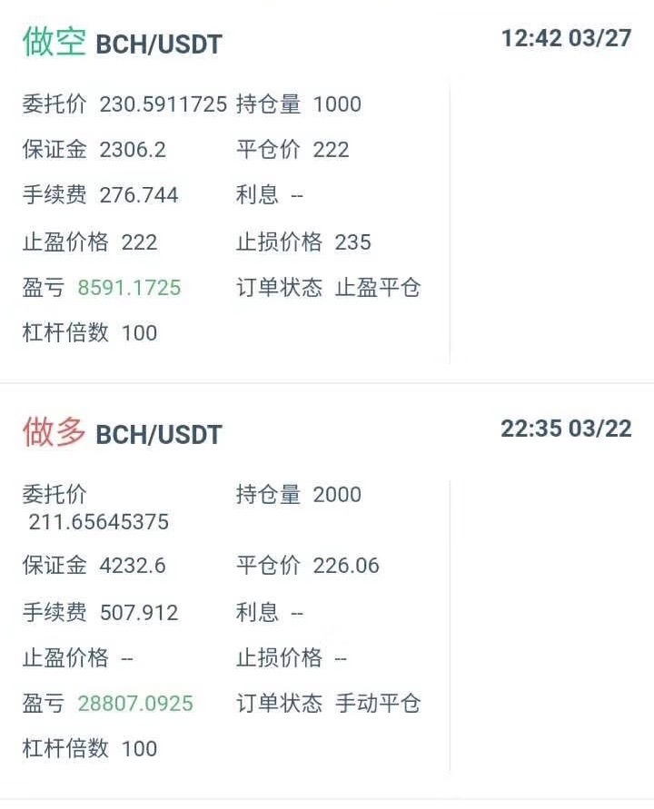

# 序：币圈常见的坑们

如果你可以选择，那一定不要选择来币圈，因为这里没有暴富，只有爆仓，没有鲜花，只有血腥，没有真诚，只有欺诈。这里比传统的金融市场更残暴，这里不讲规矩，这里每天都在演绎着一个个悲惨的故事……

当然，如果你已经进来了，那就了解一下币圈常见的那些坑们吧，对你有好处。

## 跟单平台

最近跟单平台很火，但这事儿非常不靠谱。先不说平台合不合规（当然不合规），单单是几十上百人同时跟单，也是一笔相当大的交易，这种体量的交易，就算是目前最大的交易所，也不能保证不滑点，更别说小小的跟单平台了，他们去哪弄那么多对手盘呢？很明显，对手盘就是平台自己，那问题就简单了，你用脚趾头也能想到，平台不会亏，那亏的只能是跟单的小白了（随便插根针就搞定了），你看，跟单这件事儿，从这里开始就不靠谱。最近，很多平台都来找过我，只要我承诺帮他们拉用户带单，他们就会给我丰厚的返利，从40%到80%的都有，你想想看，这么大的返利才哪里来？最后不还是得会从用户身上来嘛！所以，不要相信带单大神，在巨大的利益面前，很少人能独善其身。

## 晒收益图

朋友圈、微微信群中经常遇晒收益的，不要轻信，有专门的晒单APP，专门引诱不明真相的群众。另外，晒微信记录、说预测的如何如何准确的，也不要轻信。记住，眼见的不一定是真的。

## 免费带单群

号称不收任何费用让你进群，有老师免费带单的，请参考上面的【跟单平台】！有人说我只是进去听听课，又不交易，我告诉你，那些深陷传销的都是从免费听课开始的。

## 奶币

这里的币指的不是BTC、ETH等主流币，而是哪些18线的小币。奶币的过程通常是某大V振臂一呼：我要买这个币了！我强烈看好它！安心拿着！它会增长百倍……不明真相又想暴富的小白买入后，大V就会与专家配合砸盘。在砸盘的过程中，大V还会这样安抚小白们：不要慌，就是庄家洗盘而已，马上就会暴拉。结果币归零了，大V就会装出一副可怜的模样：臣妾也是受害者啊！

