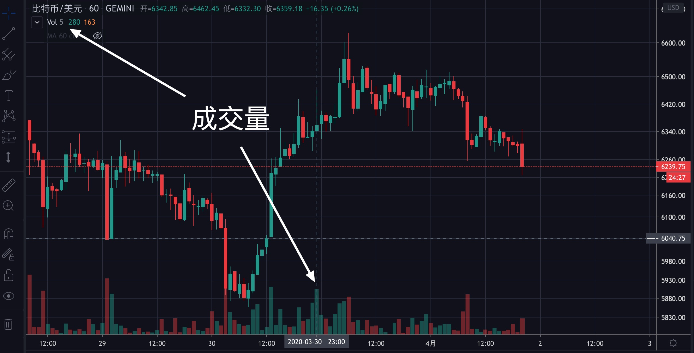
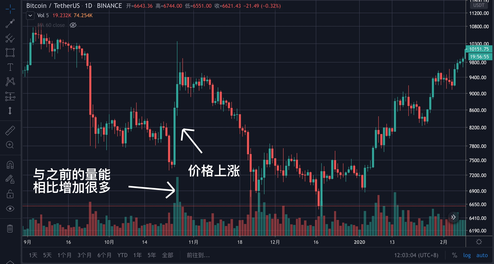
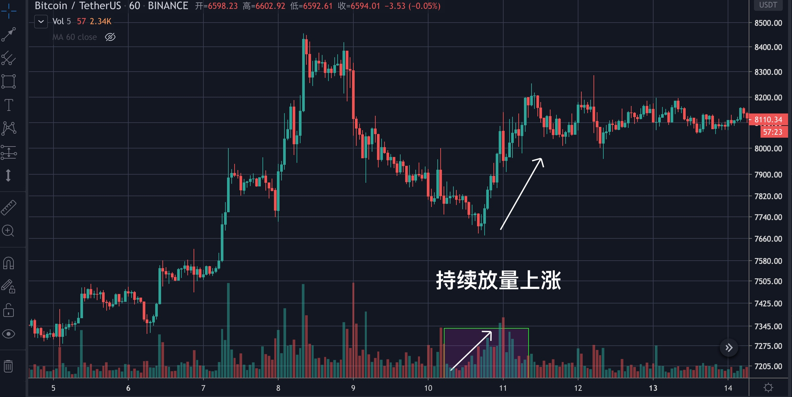
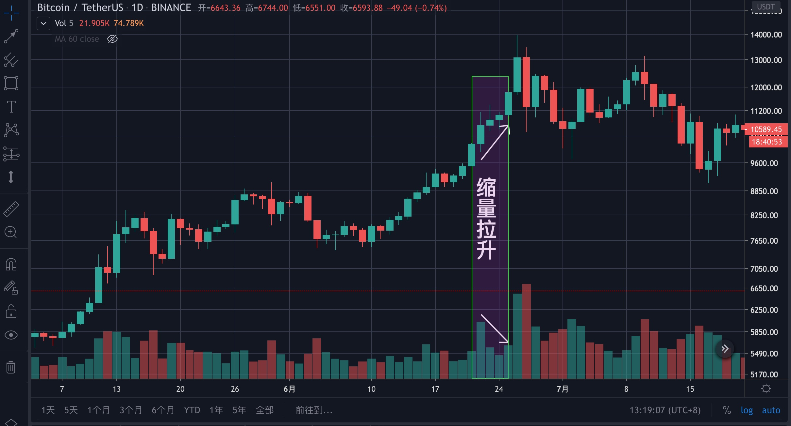
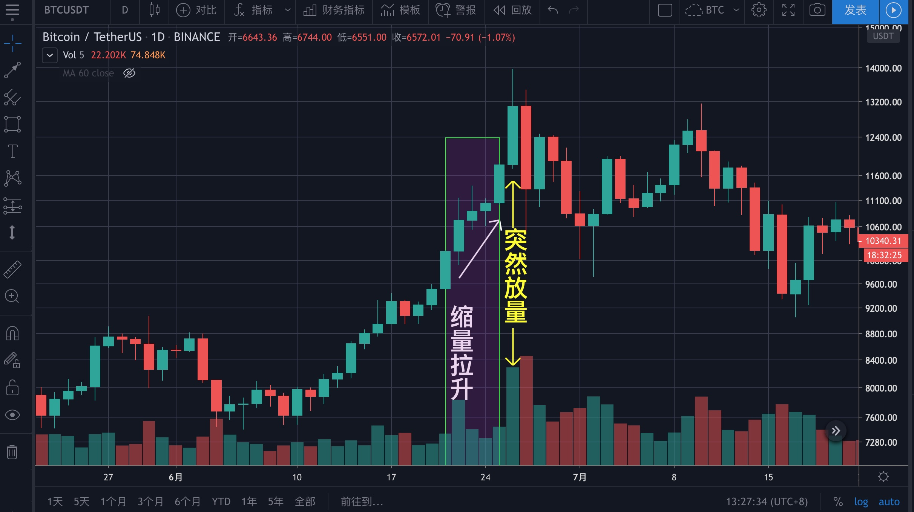
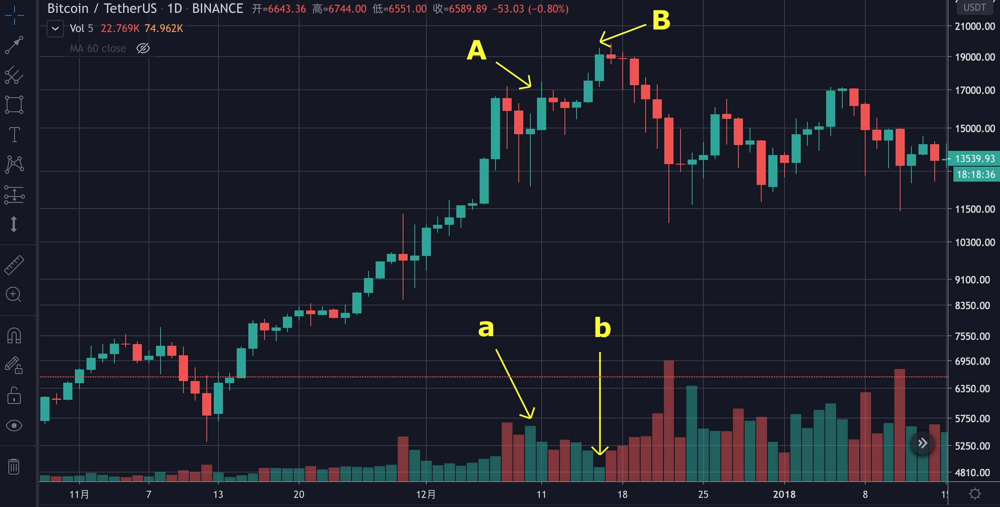
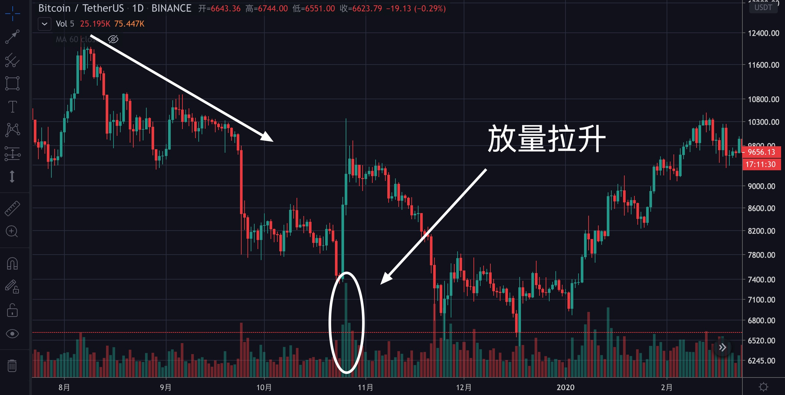
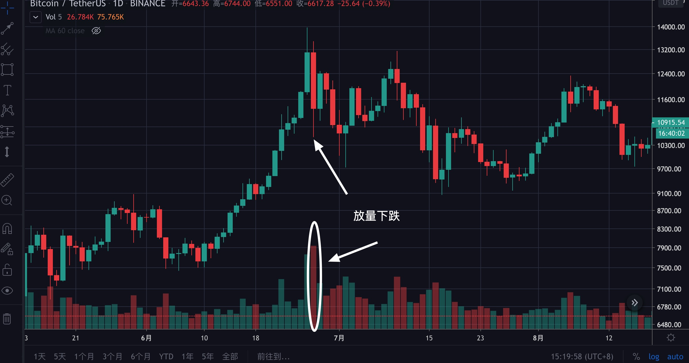
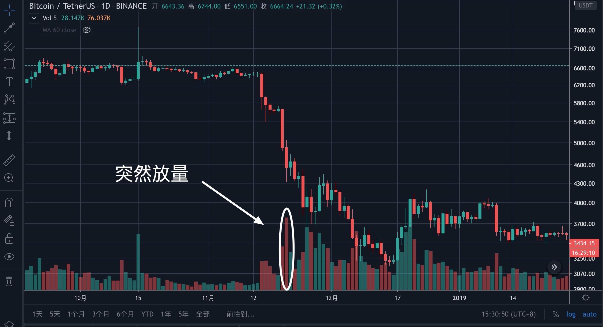

# 第六章：高级技术之量价关系

至此，你已经学会用一些基本指标了，但你还是发现，无论你如何熟悉这些指标的用法，你还是看不出市场的走势。究其原因，就是你没有掌握量价关系的缘故。

## 成交量

定义：成交量是指某一时段内的交易数。

> 通俗的说法是：比如我现在要买一个BTC，你要买一个BTC，当这笔交易达成后，成交量就是1；而如果我想买，你却不想卖了，那么这笔交易就不会发生，那么成交量就是0。

上图中，下方红色和绿色的柱子就是成交量图，左上角是当前光标所在位置成交量的具体数值。

**你需要理解的**

* **成交量是一种供需表现，买卖双方是等量的**，并不会出现买方多于卖方的情况。比如上升趋势中的放量上涨，并不是说买入的多卖出的少，而是说大家买入的意愿更强。**注意，价格上涨时资金就是流入的说法是错误的。**
* **图表中量能柱子的颜色不重要，大小才重要**，币市中什么都可以骗人，唯有量是真实的，成交量的大小表示的是买卖双方对价格的认同程度，对价格分歧越大，成交量就会越大，对价格的分歧较小，成交量就越小。

## 量价关系

* 放量：放量一般发生在趋势即将转变的时候，一部分人坚决看好，一部分人坚决看空，多空分歧增大，促进买卖双方成交。
* 缩量：缩量一般发生在牛市的顶部或熊市的底部，在顶部时，大家一致看好后市，都不愿意卖出；在底部时，大家都后市非常悲观，只有人卖，却没人买。

**①放量上涨**

上图是一段BTC日线图，可以明显的看出，量能突然增加，价格快速上涨，这就是放量上涨。

但是，咱们再看第二天的量能，迅速萎缩，**这就是量能没有持续，上涨行情可能走不远**。

**②持续放量上涨**

上图中，是多头最喜欢的，量能持续增加，价格稳步上涨，预示着后市在盘整后大概率会继续上涨。

**③缩量拉升**

上图中，量能在减少，价格却在上涨，说明行情走不远，是个警惕信号。缩量拉升一般出现在上升行情的末期，有时候也出现在下跌中期的反弹中。

④**上涨趋势中突然放量**

还是同一张图，在一段上升趋势中，突然放量拉升，**量能比近期任何一根都大**，再结合K线篇中**上影线的含义**，说明此处的多空力量已经转换（多方力正在枯竭，空方力量正在增加且已经超过多方，造成**高位滞涨**），且前面一段是**缩量拉升**，这是行情见顶的迹象。

这时候要注意，无论媒体如何炒作，说区块链前景如何如何好，也不要轻信，此时即使不卖出，也一定不要再买入了。

**⑤走了很久的上涨趋势中价格破前高但量能没破前高**

上图中，是一段已经走了很久的上升趋势，价格破了前高（ $$B>A$$ ），但量能没有破前高（ $$b<a$$ ），预示着上涨趋势可能会停止。

其实上图也是缩量拉升的一种，需要注意的是，这里所说的走了很久，并无法用一个确定的数值来表示，是需要经验来判断的。

**⑥下跌趋势中突然放量拉升**

在一段下跌趋势中，如果遇到突然放量逆势拉升的情况，一定要警惕，这种拉升往往因利好消息引起，通常不会持续太久。上图中就是2019年10月25日国家领导人首次把区块链提升为国家战略后，引发了散户抢筹，导致BTC逆势暴涨，后来的事大家也都知道了，暴涨之后很快就再次进入了下跌趋势，这也说明大趋势很难通过消息面来逆转。

**⑦高位放量下跌**

在一段行情的高位，突然出现放量下跌的情况，通常是主力出资金出逃的迹象，预示着这段行情可能将结束。

**⑧下跌过程中的突然放量**

在一段下跌趋势中，如果突然出现放量，则有两种情况，第一种是跌破某一重要支撑，主力资金出逃；第二种是行情快要见底了，这是最后的一哆嗦（男同胞都深有体会）。但无论哪种情况，都不要有抄底的想法，因为底部往往会持续很久，等形势明朗了再抄底更安全。

同时也说明，**左侧建仓**（越跌越买）的策略有很大的风险！

**你需要记住的**

* 量能是市场前进的燃料，没有量能，市场走不远。
* 无论缩量拉升还是缩量下跌，都**可能**不是市场的真相。
* 量价关系只适用于大币种，小币种太容易被主力操纵。
* 我做BTC现货时，不会去看比1小时更短的周期。
* 参考大交易所的K线图，小交易所意义不大。大的交易所有币安、火币、OKEX、Coinbase、Bitfinex等。

