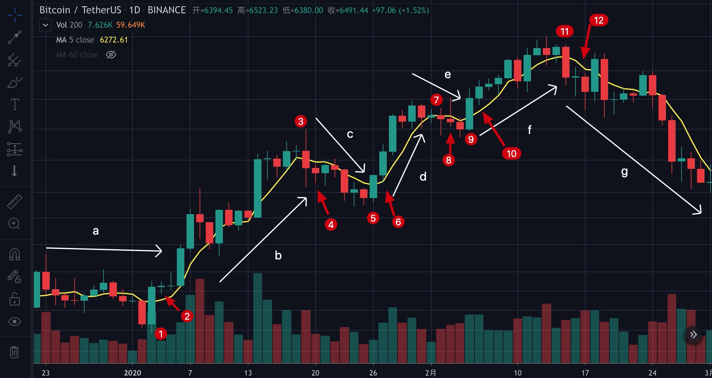
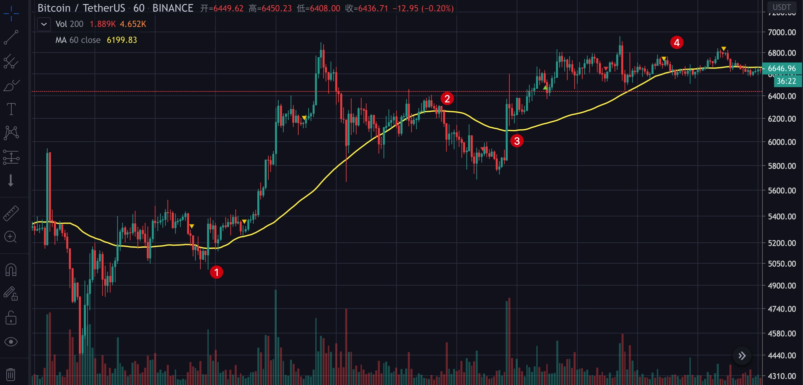
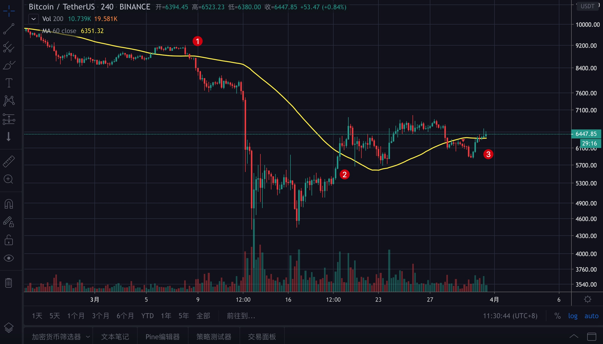
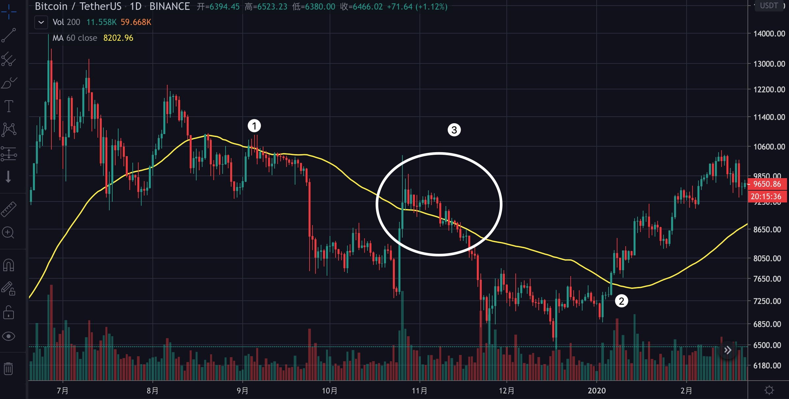

# 第三章：基础知识之MA篇

## MA是什么

MA，是Moving Average的简称，中文叫移动平均线，你可以理解为一段时间内的平均筹码。比如5日线，也就是日线的MA5，一般的计算方法是用前5天的收盘价相加后再除以5。

当然，你也可以使用每日开盘价来计算，或者用最高价或最低价来计算，甚至用最高价与最低价的均价来计算都是可以的，你只需知道MA是一个统计值就行了，只要你自己用着习惯就好。

注：村长习惯以每日收盘价计算。

## 常用的MA

我平时用到的均线有MA5，MA10，MA30和MA60，时间周期包括1小时，4小时，一天，一周，一月，这样就可得到下面的合租。

小时线MA60：用来判断未来1-2天内的走势。

4小时MA60：用来判断未来3-10天内的走势。

日线MA5、MA10、MA30：组合起来可判断未来几天至几周的走势。

日线MA60：用来判断未来10天至数月的走势。

## MA的具体应用

均线有价格回归的作用，如果价格偏离均线太远，后面最有可能的趋势就是向均线靠拢。但不均线对价格的敏感度不同，下面我们先以5日线为例来讲解。

在a之前，行情一直受5日线的压制，a点突破5日线，行情开始上涨，b点跌破5日线后开始下跌，c点再次站上5日线，行情又进入了上涨模式。

**挖掘内在的原因**：

> 当币价远高于5日线时，就说明5天以来买入的人大都赚了，在盈利时，大多数人都会选择落袋为安（卖出操作），这样币价就会下跌至5日线附近。
>
> 当币价远低于5日线时，则说明币价比较便宜，就会吸引一些短线交易者买入，这样币价就会上涨至5日线附近。

### 5日线的用法

* 买入

> 当价格站上5日线，5日线又拐头向上，后市行情看涨，可买入。

* 卖出

> 当价格跌破5日线，5日线又拐头向下，后市行情看跌，可卖出。

* 观望

> 5日线走平，就是震荡震荡，观望。

### 5日线用法实例

a段是震荡行情，观望；①处突破5日线，且5日线拐头向上，第二天当价格回到5日线附近可买入（图中②所示），行情进入b上涨；③处跌破5日线且5日线拐头向下，则等第二天价格反弹至5日线附近可卖出（图中④所示），行情进入c阶段……以此类推。

操作时需要注意的是一定要学会止损，如果上图中②所示的那天回测5日线没有成功，而是跌穿了5日线，那止损就行了。当然，至于在哪个点止损，得看具体情况，这就需要你有大量的看盘经验了，也不用急，看多了就会了。

### 我常用的其他均线

**10日线**：10日线是比5日线容错率更高的一条线，我会用它预测反弹或回调的点位，同时也用他结合5日线与30日线看当前的主趋势。

**小时线MA60**：中短线交易最重要的参考线

> 上图中，①③是买入点，②④是卖出点，对中短线交易具有重要的指导意义。

**4小时线MA60**：中线交易最重要的参考线。

悄悄告诉你：其实4小时MA60与10日线差不多，不信你算一下：）

> 上图中，①是卖出点，②不是买买入点，③是潜在买入点。

这里有人会有疑问，②为什么不能买入呢？因为均线的方向是朝下的，并没有走平或上翘。③为什么是潜在的买点呢？均线走平了，但没有上翘，只能暂时用潜在买点看待。

_顺便提一下，上图用的是今天（2020年3月31日）BTC/USDT的走势图，目前已经站上了4小时MA60，其该线已经开始上翘，后面可能会继续反弹哦。想要买入的，可以等回踩至4小时MA60附近的机会。_

**60日线**：中长线交易最要的参考线

> 上图中，如果你能在①处卖出，在②处买入，即使中间经历了③处的暴力拉盘，只要你严格按照买卖点操作，在大方向上都是不会出错的。

## MA最本质的作用

到了这里，我该跟你说实话了，上面说的均线对行情有支撑作用其实并不准确，在均线之上的行情仍然会跌，在均线之下的行情仍然会涨。

那么均线最本质的作用是什么呢？

以我为例。

**如果在60日线之上且均线上翘，就是强势行情，逢低做多，如果在60日线之下且均线下探，就是弱势行情，逢高做空。**

这才是均线最正确的用法！

## 温馨提醒

1. 均线往往需要配合其他均线使用，单一均线出错率高。
2. 均线还需要配合其他指标使用，单一指标出错率高。
3. 现货交易最小也要看到1小时周期，小于1小时对现货的指导意义不大，合约交易才需要参考更小的周期。
4. 均线最大的弱点是滞后性。

