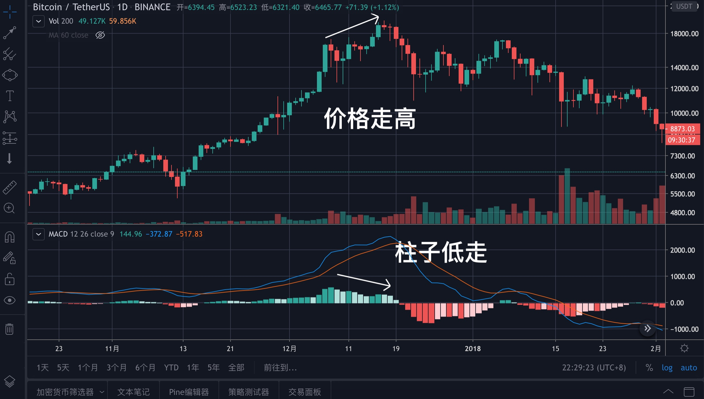
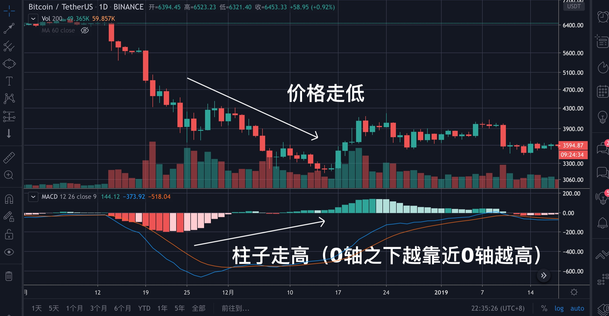

# 第五章：基础知识之其他指标篇

除了前面介绍过的指标与工具外，还有一些常用的辅助指标，下面分别介绍一下。

## MACD

> MACD称为指数移动平均线，由快的指数移动平均线（默认值EMA12）减去慢的指数移动平均线（默认值EMA26）得到快线DIF，再用2×（快线DIF-DIF的9日加权移动均线DEA）得到MACD柱。

MACD的意义：由快、慢均线的离散、聚合表征当前的多空状态和币价可能的发展变化趋势，MACD的变化代表着市场趋势的变化，不同K线级别的MACD代表当前级别周期中的买卖趋势。

上图红色圈起来的就是MACD，由DIF线（快线）、DEA线（慢线）与柱子组成。其中上边柱子与下边竹子接触的地方是0轴。

**你需要记住的是**：

当两条线在0轴上方时，表示目前是上涨趋势，其中柱子越高，代表上涨的动能越强，如上图。

当两条线在0轴下方时，表示目前是下跌趋势，其中柱子越高，代表下多的动能越强，如上图。

当DIF线上穿DEA线时（不管是否在0轴之上），金叉形成，是买入点位，如上图。

当DIF线下穿DEA线时（不管是否在0轴之下），死叉形成，是卖出点位，如上图。

但是，一定要注意下面这种情况。

在0轴线上，出现“金叉”后，又出现“死叉”，但不下穿0轴线，几日后在0轴线上再次出现“金叉”，为“轴线上二次金叉”，这是最佳的买入点，如上图。

#### 顶背离

当价格走高，MACD上的柱子却走低时，就是顶背离，这是趋势即将逆转的迹象，是卖出点，如上图，2017年的大牛市就是这样结束的。

#### 底背离

当价格还在持续走低，但柱子却在向0轴靠拢时，就是底背离，这是行情见底却要拉升的迹象，是买入点，如上图。

**需要注意的**

* 对大周期更准确，如日线周线。
* 对大币种更准确，如BTC和ETH。
* 无论金叉还是死叉，都需要与其指标配合使用才能更准确确认买入或买入点。

## RSI

