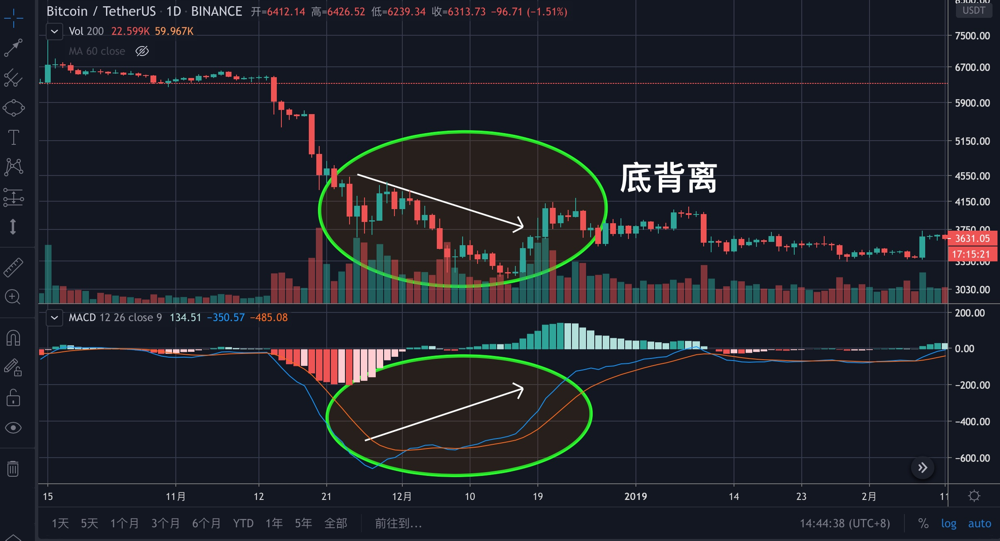

# 第五章：基础知识之其他指标篇

除了前面介绍过的指标与工具外，还有一些常用的辅助指标，这些指标单独使用时可能不准确，但若能和其他指标配合起来一起用，则会对行情的判断大有帮助。

## MACD

> MACD称为指数移动平均线，由快的指数移动平均线（默认值EMA12）减去慢的指数移动平均线（默认值EMA26）得到快线DIF，再用2×（快线DIF-DIF的9日加权移动均线DEA）得到MACD柱。

MACD的意义：由快、慢均线的离散、聚合表征当前的多空状态和币价可能的发展变化趋势，MACD的变化代表着市场趋势的变化，不同K线级别的MACD代表当前级别周期中的买卖趋势。

上面这些你不理解也没关系，记住下面的就行。

上图红色圈起来的就是MACD，由DIF线（蓝色）、DEA线（橘色）与柱子组成（看盘软件不同，线的颜色也会有所区别）。

其中上边柱子与下边柱子相交的地方是0轴。

**你需要记住**

当两条线在0轴上方时，表示目前是上涨趋势，柱子越高，上涨的动能越强，如上图。

当两条线在0轴下方时，表示目前是下跌趋势，柱子越高，下跌的动能越强，如上图。

当两条线均在0轴之上，但都掉头向下时，一般表示为行情即将走弱，币价可能下跌，可以卖出和观望（参考下面的死叉）。

当两条线均在0轴之下，但都掉头向上时，一般表示为行情即将启动，建议买入或观望（参考下面的金叉）。

当DIF线（ 蓝色）上穿DEA线（橘色）时（最好在0轴之下，0轴之上可能遇到主力诱多的情况），金叉形成，是买入点位，如上图。

当DIF线下穿DEA线时（最好在0轴之上，0轴之下可能遇到主力震仓的情况），死叉形成，是卖出点位，如上图。

但是，一定要注意下面这种情况。

在0轴线上，出现“金叉”后，又出现“死叉”，但不没有立即下穿0轴线，而是粘合在了一起，几日后在0轴线上再次出现“金叉”，为“**轴线上二次金叉**”，这是最佳的买入点，如上图。

### 顶背离

在一段上升趋势中，当价格（K线收盘价）创新高，DIF线却没有创新高，就是顶背离，这说明上行无力，行情即将横盘或者回调，是潜在的卖出点，如上图，2017年的大牛市就是这样结束的。

### 底背离

在一段下降趋势中，当价格创新低，但DIF（蓝色线）却没有创新低，就是底背离，这说明下行可能会被终止，是潜在的买入点，如上图。

**注意事项**

* MACD的背离比金叉死叉更准确。
* 对大周期更准确，如日线周线。
* 对大币种更准确，如BTC和ETH。
* 无论金叉还是死叉，都需要与量能等其指标配合使用才能更准确确认买入或买入点。

## RSI

> 相对强弱指数RSI是根据一段时期内上涨和下跌幅度之和的比率制作出的一种技术曲线，能够反映出市场在一定时期内的景气程度，是用以计测市场供需关系和买卖力道的方法及指标。

公式：N日RSI =N日内收盘涨幅的平均值/\(N日内收盘涨幅均值+N日内收盘跌幅均值\) ×100

> 由上面算式可知RSI指标的技术含义，即以向上的力量与向下的力量进行比较，若向上的力量较大，则计算出来的指标上升；若向下的力量较大，则指标下降，由此测算出市场走势的强弱。

如果你不想看上面这些，那你只需要记住，RSI的数值在0-100之间，**我们平时所说的超买、超卖，都是根据RSI得出来的。**

**作用**

1. 用来判断当前市场是否超买、超卖
2. 用来判断当前市场是否背离

**用法**

**1.超买与超卖**

其中 $$RSI<30$$ 为超卖，其中 $$RSI<20$$ 为严重超卖， $$RSI>70$$ 为超买，其中 $$RSI>80$$ 为严重超买。

上图中，当BTC价格下跌至时4400，RSI的出现了最低值5.78，是严重超卖，说明这里有反弹需求，结果第二天币价先是下探到3800后又马上开启了一波反弹。

上图中，当BTC价格上涨至13900附近时，RSI的值是96，显示严超买，价格有停止或者下跌的需求，第二天的走势也证明了RSI的可靠。

_**思考：发生超卖或超买后，价格一定会上涨或下跌吗？**_

> 不一定，除了下跌，超卖或超买还可以通过横盘整理来缓解。

**2.背离**

上图是一段上升趋势，到达高点后，价格仍在走高（价格创新高，指标没有创新高），但这时候的RSI已经在走低了，这就是顶背离，顶背离通常是行情见顶或阶段性见顶的标志。

上图是一段下降趋势，到达低点后，价格仍在走低（价格创新地，指标没有创新低），但这时候的RSI已经在走高了，这就是底背离，底背离通常是行情见底或阶段性见底的标志。

**注意事项**

* RSI在强趋势行情中会失灵，比如很多时候尽管已经严重超买了，但价格却已经突破了新高，量能也很配合，则就要忽略掉该指标。**很多新手一看到超买了就卖出，就会导致在强趋势行情中失去更大的机会。**
* RSI参数一般设置为6、14和24，短看6，中期看14，长期看24，一般看6就能解决大部分的问题。
* 有的书上说RSI也有金叉死叉，我认为RSI的金叉死叉没有MACD的金叉死叉准确，因此大家可以忽略RSI的金叉死叉。
* 单一指标指导性不强，要与量能等其他指标配合使用。
* 适用于大市值币种。

## KDJ

> KDJ又叫随机指数，广泛用于币市的中短期趋势分析。

**公式**

KDJ的公式老复杂了，不懂不影响使用，想了解去网上搜吧，这里不再赘述。

**作用**

* 用来判断超买与超卖，**比RSI更好用，更灵敏**。
* 根据金叉与死叉来判断买入点与卖出点

**用法**

* 参数一般设置为9，3，3
* D线在20以下，超卖，D线在80以上，超买
* （最好在20以下），K线上穿D线，形成金叉；（最好在80以上），K线下穿D线，形成死叉。

上图中，蓝色的是K线，橘色的是D线（看盘软件不同，线的颜色也会有所区别），判断超买与超卖时，只需要看橘色的D线。当D线降到20以下为超卖，这时候不建议再卖出了，而应该考虑买入；当D线升至80以上为超买，这时候就不要买入了，而应该考虑卖出。

上图中，K线与D线均在80之上，并且K线下穿D线，形成死叉，预示后市即将下跌，与卖出信号；K线与D线均在20之下，并且K线上穿D线，形成金叉，预示着后市即将上涨，是买入信号。

但是，上图中金叉之后没多久，再次形成死叉，虽然是在20-80区间形成的，但仍然是卖出信号，只是没有80上方死叉的卖出信号强烈。

**具体买卖点位**

* 金叉买入，死叉卖出。
* 当D跌破20时，可以小仓位买入，当D线才20以下突破20时，可用大一点的仓位买入。
* 当D线突破80时，_就要准备卖出了_，从D线从80的上方跌破80时，实施卖出操作。

**注意事项**

* KDJ在强趋势行情中会失灵，比如很多时候尽管已经严重超买了，但价格却已经突破了新高，量能也很配合，则就要忽略掉该指标。**很多新手一看到超买了就卖出，就会导致在强趋势行情中失去更大的机会。**
* KDJ在刚开始只有K和D两条线，后来才发展成KDJ三条线，但我们平时的操作时，只需要看KD两条线即可，在某些看盘软件中，是没有J线的。
* KDJ指标灵敏，必须与量能等其他指标配合着使用。
* 适用于大市值币种。

