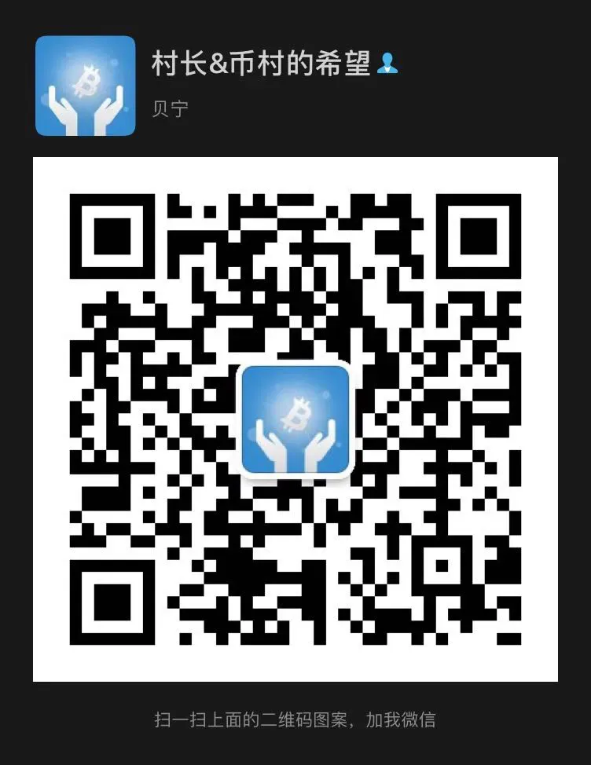

# 欢迎大家加入我的圈子

> 培养独立的投资思维 建立科学的投资策略

这里并不是你认为的那种喊单社群，我们会将重点放在独立思考能力的培养以及交易系统的打造上，虽然喊单可能会使你短时盈利，但长期来看，想要实现稳定盈利，还得自己亲自去交易。

总之，希望大家理解，授之以鱼不如授之以渔。

* 如果你是小白，想从零学习币圈投资的本领……
* 如果你被币圈的各种骗局骗过……
* 如果你已经学会了均线、趋势线等指标的用法，但在实战中却不能灵活使用……
* 如果你总是亏钱，始终找不到一种盈利的方法……

那么加入我的VIP小组吧，这里注重交易理念的培养，更注重交易系统的打造。

## 1.【会员专享】服务的价格？

| **原价：** | **现价：** |
| :--- | :--- |
| 季度会员699元（有效期3个月） | 399元（季度会员） |
| 年度会员2299元（有效期1年） | 1299元（年度会员） |

## 2.【会员专享】都包括哪些服务？

* 村长仓位公开（★★）
* 一对一指导（★★★）
* 潜力币种挖掘（★★★）
* 突发行情分析（★★★） 
* 现货加减仓指导（★★★★）
* 主流币走势分析（★★★★）
* 抄底逃顶提醒（★★★★★）
* 合约趋势单指导（每年一两次的大行情机会）（★★★★★）

## 3.这里是带单社群吗？

NO!  
策略版行情分析中的内容主要是村长实盘的内容，我怎么买卖都会在这里公布，我抄底了会让你抄底，我逃顶了会让你逃顶。除此之外，还会经常对各种主流币、潜力币进行分析、策略制定与风险提醒，以及每年1到2次的合约趋势单机会（**就是你看过的赚了好多倍的那种单子**），让你不再错过大行情。

## 4.操作记录

你点击[这里](http://mp.weixin.qq.com/s?__biz=MzA5MTc4ODA2Nw==&mid=2457528052&idx=2&sn=0b15057823e39a91c27c73dcc8d5b79c&chksm=87f940b8b08ec9ae5a995b7ccacfd2d4c60e66566023630da5e95c2f50b9b60ed798cfaec72c&scene=21#wechat_redirect)，即可查看以往的操作记录，无论成功的还是失败的，都让你看。

## 5.成为『会员』能得到什么？

国内懂金融、会投资的人很少，币圈则更少，希望我的知识能影响到一部分人，使得大家在币圈能长久活下去。在这里大家学到的不仅仅是技术，技术只是一部分，甚至连50%的比重都不到，更重要的还有交易心理、投资逻辑等这些更偏向哲学的知识，这些都是我近几年的积累，我会将这些知识毫无保留的分享出来，希望我的会员能与我一起进步，在多年后再回想起来时，能够会心的一笑：原来村长没有骗我，跟着他真的少走了不少弯路​。​  

## 6.如何购买【会员】服务？

请添加村长微信（3768126）购买

