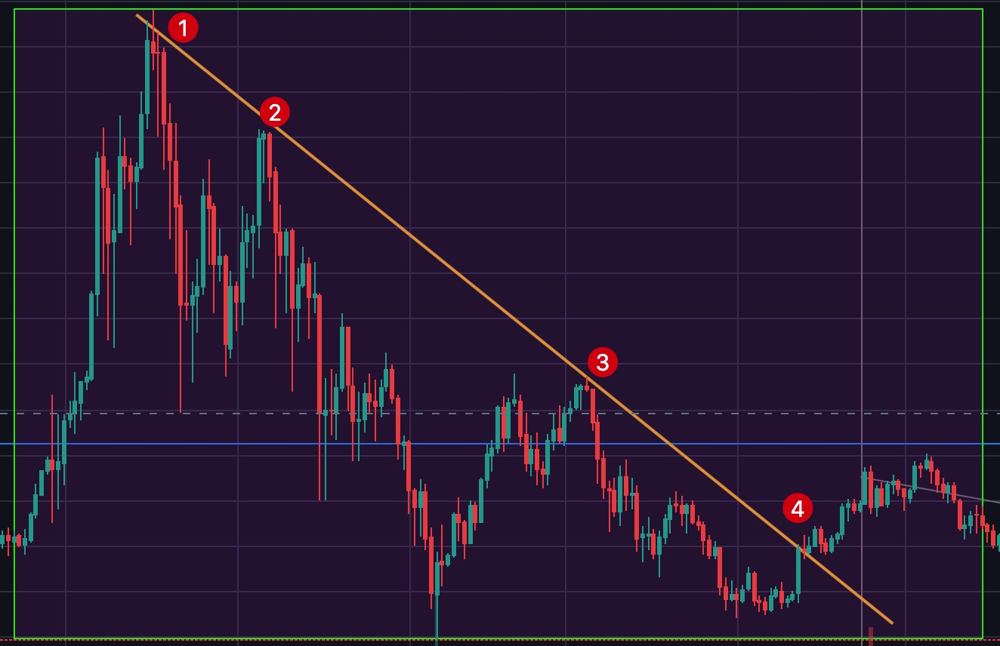

# 第二章：基础知识之趋势线篇

## 趋势的概念

一段行情只会有三种趋势，上升趋势，下降趋势，震荡。当然，也有人认为震荡不算趋势。

上图中的（A）

> ①③⑤是低点，②④是高点，像这种低点抬高，高点抬高的走势就是上升趋势。

上图中的（C）

> ③⑤是低点，①②④是高点，像这种低点降低，高点降低的走势就是下降趋势。

上图中的（B）

> 高点之间没有明显的差别，低点之间也没有明显的差别，这样的走势就是震荡趋势，也横盘。

## 什么是趋势线

#### 上升趋势线

> 在一段上升趋势中，连接两个或两个以上的低点画一条直线，这条线就是上升趋势线。

#### 下降趋势线

> 在一段下降趋势中，连接两个或两个以上的高点（最少3个点）画一条直线，这条线就是下降趋势线。

## 趋势线的应用

> 趋势线通常被用来判断当前的趋势。很多教程里说，趋势线对价格有压力或支撑作用，但我认为这样说不严谨，趋势线对价格并没有支撑或压作用，它只是一条线而已，仅做为对当前趋势判断的依据。

上升趋势线用于上升趋势的判断，趋势线上的落点越多，在趋势线上方运行的时间越长，趋势线就越有效，上升趋势就越强。

下降趋势线用于下降趋势的判断，趋势线上的落点越多，在趋势线下方运行的时间越长，趋势线就越有效，下降趋势就越强。

当趋势线被有效突破（跌破）后，这条趋势线就开始起反作用了，也就是我们经常同说的趋势转变了。

趋势线被有效突破（跌破）后，耐心等待回测，回测点就做多（做空）的绝佳位置。

## 趋势线的斜率

## 趋势线的调教

## 趋势线的陷阱

