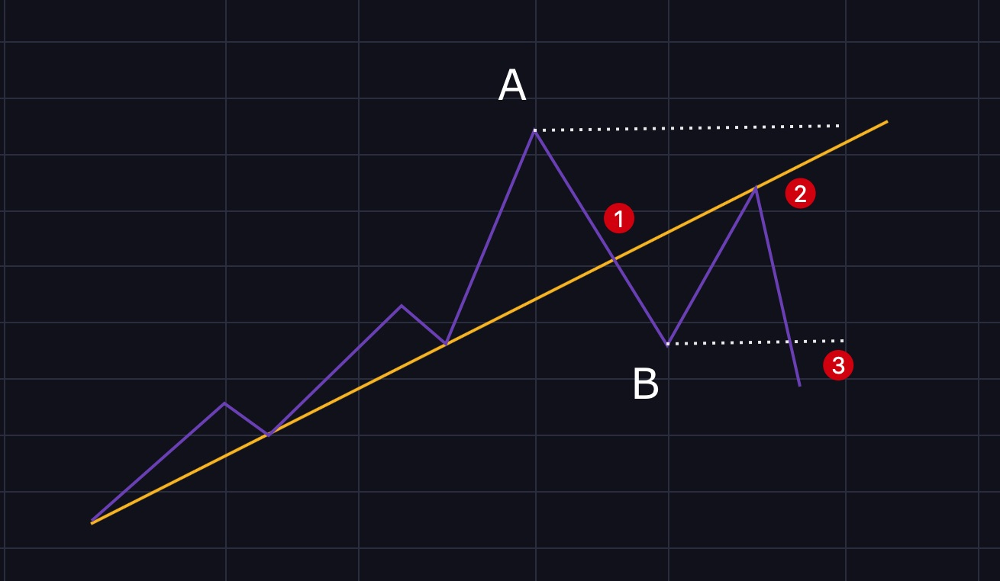

# 第二章：基础知识之趋势线篇

## 趋势的概念

一段行情只会有三种趋势，上升趋势，下降趋势，震荡。当然，也有人认为震荡不算趋势。

上图中的（A）

> ①③⑤是低点，②④是高点，像这种低点抬高，高点抬高的走势就是上升趋势。

上图中的（C）

> ③⑤是低点，①②④是高点，像这种低点降低，高点降低的走势就是下降趋势。

上图中的（B）

> 高点之间没有明显的差别，低点之间也没有明显的差别，这样的走势就是震荡趋势，也横盘。

## 什么是趋势线

#### 上升趋势线

> 在一段上升趋势中，连接两个或两个以上的低点画一条直线，这条线就是上升趋势线。

#### 下降趋势线

> 在一段下降趋势中，连接两个或两个以上的高点（最少3个点）画一条直线，这条线就是下降趋势线。

## 趋势线的应用

> 趋势线通常被用来判断当前的趋势。很多教程里说，趋势线对价格有压力或支撑作用，但我认为这样说不严谨，趋势线对价格并没有支撑或压作用，它只是一条线而已，仅做为对当前趋势判断的依据。

上升趋势线用于上升趋势的判断，趋势线上的落点越多，在趋势线上方运行的时间越长，趋势线就越有效，上升趋势就越强。

下降趋势线用于下降趋势的判断，趋势线上的落点越多，在趋势线下方运行的时间越长，趋势线就越有效，下降趋势就越强。

当趋势线被有效突破（跌破）后，这条趋势线就开始起反作用了，也就是我们经常同说的趋势转变了。上图中在④处价格突破下降趋势线，预示着这一段下跌行情暂缓或结束。需要注意的是，突破下跌趋势线并不意味着下跌结束了，而是说“**沿着被突破的这条趋势线的下跌**”结束了。

趋势线被有效突破（跌破）后，耐心等待回测，回测点就做多（做空）的绝佳位置。如上图中的②就是最佳做多的点。

## 趋势线的斜率

趋势线的斜率又可称为趋势线角度。

20-30度角说明趋势不强，趋势尚不牢靠，被反转的可能性较大。

45度左右最稳定，这时候的趋势最强，最不容易被改变 ，一般都会走出一段长长的趋势。

大于60-70度角最不稳定，通常会在趋势末期发生，预示着趋势很快会被改变，也是牛市逃顶的一个信号，注意，这里只适合牛市逃顶，不合适熊市抄底。

## 趋势线的调教

当趋势线角度发生改变时，原趋势线不再适用，这时候就需要一条新的趋势线。上图中的（B）就调教后的新趋势线。

## 趋势线的反抽

有很多新手，只要看到趋势线被跌破了就会立刻买入或做多，例如上图中点就是新手们最喜欢的卖出或做空点，结果卖出（做空）后行情却又开始涨了，这多是新手们不懂趋势线反抽的原因。

什么是趋势线的反抽呢？

在很多时候（至少80%的情况），趋势线被突破（跌破）后，并不会立刻上涨（下跌），而是会线向着反方向运行，直触及到趋势线（上图中的B点），然后再掉头，这就是趋势线的反抽。

#### 还有一种非常重要的情况！

如上图，如果不看这条趋势线，那么B点相对前期高点A点来说已经创新高，那么B点的最佳操作并不是卖出，而是买入，但如果考虑到趋势线，你一眼就能看出趋势线已经被跌破，B点的最佳操作应该是卖出（做空）。

很多人被套在牛市的高点，都是因为不懂趋势线！

## 趋势线的假突破

还有一种情况，跌破（突破）趋势线后，下跌（上涨）并没有持续，而是转头上涨（下跌），再次向上（向下）突破趋势线，这种情况就是假突破。

### 如何避免趋势线反抽或假突破带来的损失？

下面的123法则就是解决方法。

## 123法则

华尔街操盘手Victor Sperandeo在他的《专业投机原理》一书中，将趋势交易称为123法则，他利用这条法则，创下了连续12年盈利的惊人记录。

要想使用这条法则，必须满足以下3个条件。

1. 突破趋势线 
2. 上升趋势不再创新高，或下降趋势不再创新低（包括插针的情况） 
3. 上升趋势中，价格跌破前低，下降趋势中，价格突破前高。

如上图，①处跌破上升趋势线，②处是高点，但没有高过前期高点A（上升趋势不再创新高），价格在③处跌破了前期低点B，则③就是卖出或做空的点位，止损设置在②处。

如上图，①处突破下降趋势线，②处是低点，但没有低过前期低点A（下降趋势不再创新低），价格在③处突破了前期高点B，则③就是买入或做多的点位，止损设置在②处。

> 悄悄告诉你，其实123法则就是M顶或W底：）

### 123法则优缺点

优点：准确率非常高，把握住胜率会很大。

缺点：本质上属于右侧交易，当买卖点出现时行情已经走了一段了，抄底党不喜欢。

## 需要注意的点

* 在同时存在支撑压力位（横线）和趋势线的情况下，支撑压力线的作用要大于趋势线，也就是横线比趋势线更重要。举例：如果价格穿过了趋势线但没有穿过支撑压力线，那么不要过早的对行情下结论。
* 趋势线没有支撑压力作用，仅用来判断趋势是否延续。
* 4小时以上的级别，在画趋势线的时候可以以上下影线（针尖处）为准，4小时以内级别最好以K线实体为准，或者全部以实体为主。
* 价格幅度过大时（通常大于1000美金）最好使用对数（log）  坐标。

