# 第七章：高级技术之支撑与压力

## 定义

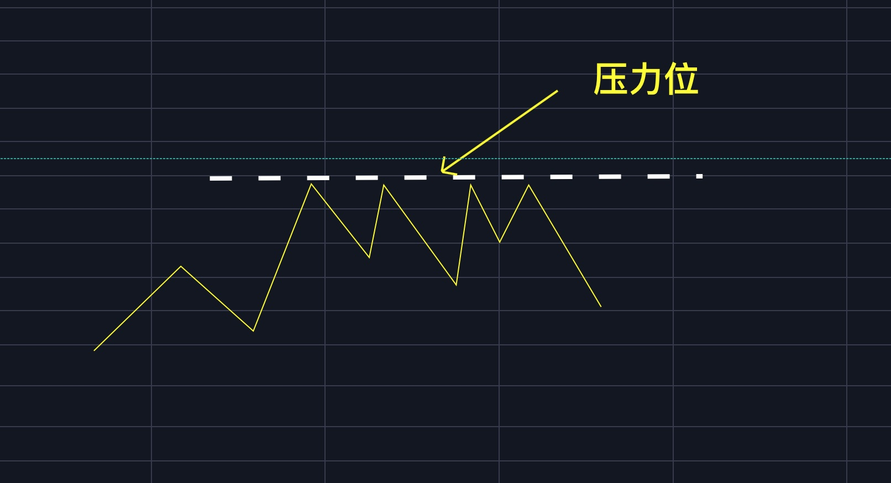

> 压力位：当币价达到某一价格附近时，似乎产生了一条对币价起到压制作用，影响价格继续上涨的抵抗线，就是压力线或是压力位。

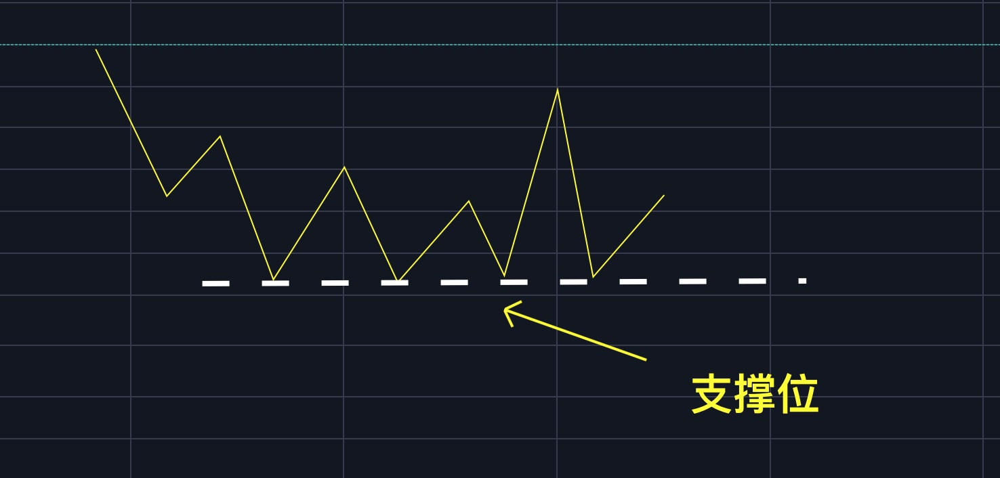

> 支撑位：当币价跌到某一价格附近时，似乎产生了一条对币价起到支撑作用，影响价格继续下跌的抵抗线，就是支撑线或支撑位。

## 需要记住的

**①支撑位与压力位互换**

支撑位被跌破后，当价格再次反弹至这个位置时，支撑位将变成压力位；

压力位被突破后，当价格再次回调至这个位置时，压力位将变成支撑位。

**②支撑位与压力位其实更应该称为支撑区间与压力区间**

严格上说，并不存在精确的支撑位与压力位，所谓的支撑与压力，其实是一片对价格有着支撑与压力作用的区域，为了让大家更方便理解，我将曾经在『VIP现货小组』中对支撑与压描述的文章摘录到下面。

> 压力和支撑就是一块能够自动复原的海绵，这块海绵有一定的厚度，能够给砸向自己的小球以阻力，而这个小球呢，就是市场运行的动能。我们先让小球向下砸向海绵，刚接触海绵边缘时，由于海绵边缘对小球的支撑力度很弱，海绵就会凹陷，随着小球越来越接近海绵中心，海绵对小球的支撑力度就越强，那么小球就有可能在海绵体内的任何一个位置停下来，这样海绵就对小球形成了支撑作用，不让小球继续下行，如果小球的动能足够大，也有可能穿过海绵。现在我们再让小球从下向上碰海绵，这时候海绵就会对小球产生阻碍作用，不让小球继续上行，如果小球的动能足够大，也有可能穿过海绵。咱们刚开始说，这个海绵有自动复原的作用，当小球从海绵体内穿过后，海绵就就马上恢复原状，当小球再次回来时，支撑作用就会变成阻碍作用，阻碍作用就会变成支撑作用。

上面的海绵就是压力与支撑区间，海绵是有厚度的，支撑与压力也是有“厚度”的。

**③沽压带与河宽的概念非常重要**

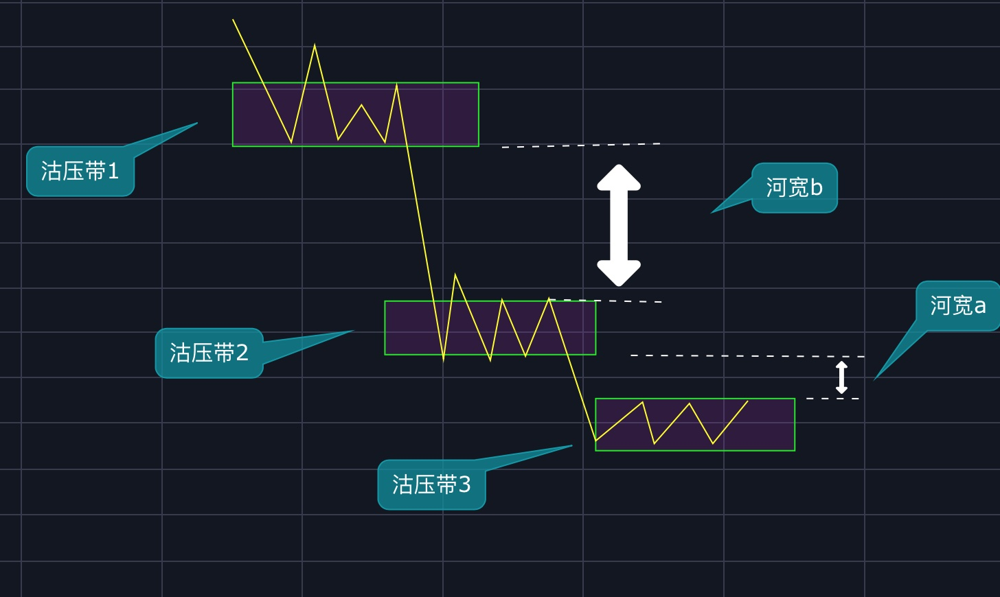

> 沽压带：当BTC从高点下跌后，在一个位置停下来进行震荡，震荡之后再次下跌，那个这个震荡的位置就形成了一条沽压带。所谓沽压，就是这里有大量的套牢盘，等价格反弹到这里时就会形成大量的压力。上图中有1、2、3三条沽压带。
>
> 河宽：两条沽压带之间的距离就是河宽。上图中有a、b两条河宽。

特点与意义：

* 当BTC在一个位置堆积的筹码越多，沽压越大。
* 当BTC在一个位置停留的时间越长，沽压越大。
* 河宽越小，压力越大。比如上图中沽压带3到沽压带2（河宽a）的压力就比沽压带2到沽压带1（河宽b）的压力大。
* 河宽的大小还代表着币价突破压力位之后的上涨空间的大小，比如上图中河宽a没有河宽b大，那么当币价突破沽压带3后的上涨空间就小于币价突破沽压带2后的上涨空间。

> **重要！**
>
> 我们在进仓位管理时，往往会参考河宽。比如上图中，我们可以在币价突破沽压带3时建仓1层，在币价突破沽压带2时建仓2层（币价突破沽压带2后的上涨空间比币价突破沽压带3后的上涨空间大）。

## **如何找压力与支撑位**

### **支撑位**

#### ①前期低点是支撑

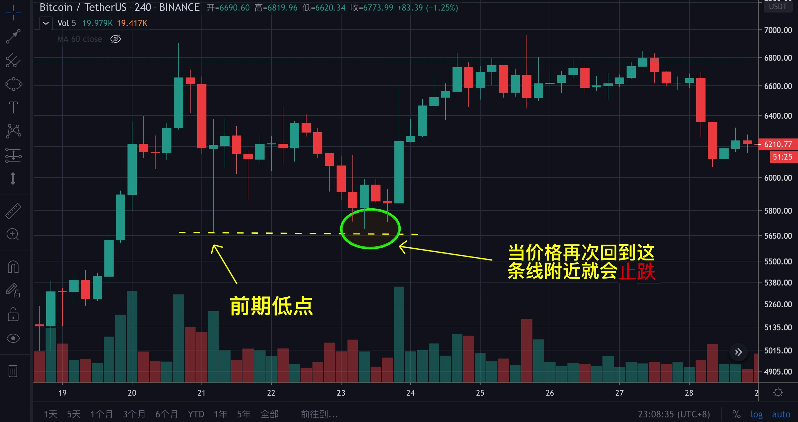

②**大阳线的上沿附近是支撑（1/3-1/2处）**

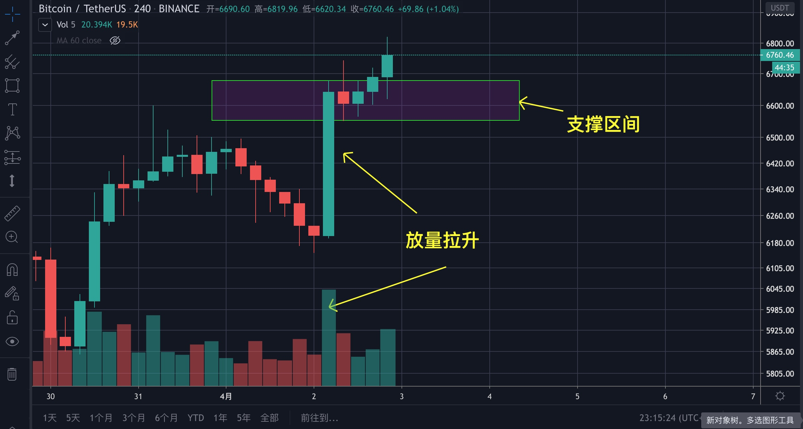

上图中长方形区域就是支撑区间**。**一般位于大阳线的1/3处，至于为何？根据道氏理论，趋势的回调中，1/3，1/2，2/3，通常都是阻力与支撑的位置，另外通过fib回撤点位38.2%，50%和61.8%也可以得出大致结论。

③**上升趋势中的斐波那契回撤点是支撑**

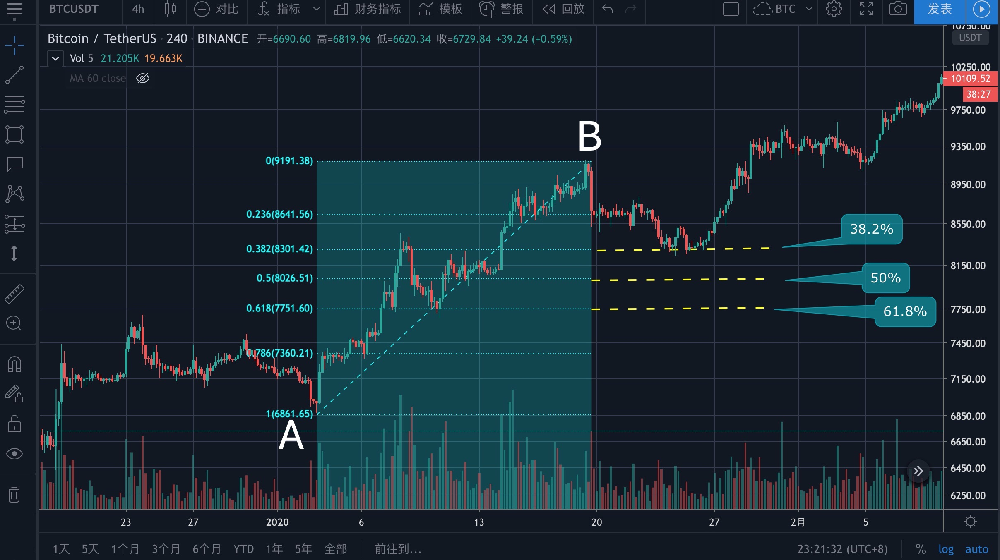

上升趋势中的斐波那契回撤点位**38.2%**、**50%**以及**61.8%**都可能形成支撑。上图中，AB之间是一段上升趋势，B后面发生了回调，在38.2%附近被支撑住，这就说明这个上升趋势是比较强的。

#### ④筹码密集区

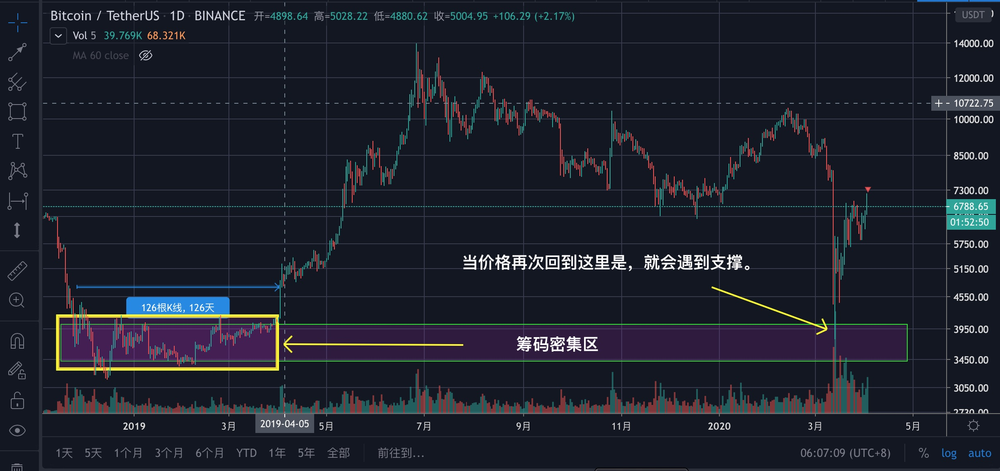

上图中，左侧黄色长方形区域就是筹码密集区，当价格再次回落至该区域附近就会产生一个支撑力。筹码密集区的特点一般是长时间的震荡行情，上图中的震荡行情用了3个月才走完。

#### ⑤趋势线

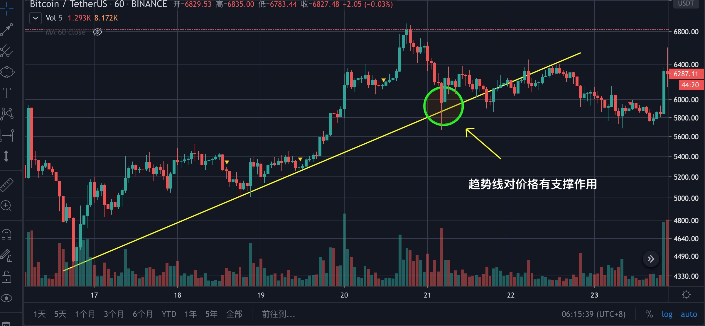

上图中，一条上涨的趋势线会对价格起到支撑作用；同理，一条下降的趋势线对价格起压制作用。

还记得吗？我在趋势线那章说过，趋势线对价格没有支撑压力作用，但现在又说有，这不前后矛盾吗？

> 不矛盾。在还多时候，趋势线对价格看似是起到了压力支撑作用，但趋势线的主要功能是**帮助你判断趋势**，向下跌破后上升趋势可能会被改变，向上突破后下降趋势也有可能被改变。如果你将趋势性看成支撑与压力位，那么就会主观上认为其不容易被突破或跌破，进而无法客观看待趋势的变化。因此，对待趋势线的正确方式是只要了解它有支承压力作用就行，但对压力与支撑的位置不必有“执念”，本来对于趋势线不同的人会有不同的画法，这就导致了不同人的判断会有差别，更重要的是趋势线的主要用途还是判断趋势是否被改变。

#### ⑥上翘的均线是支撑

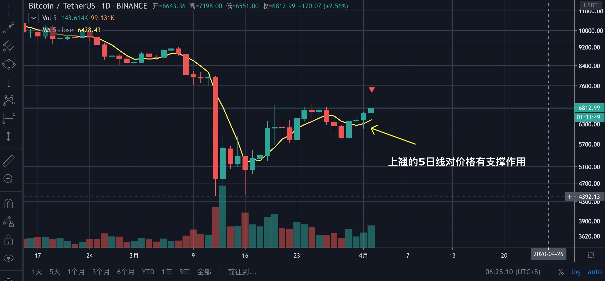

上图中，黄色的线是5日线，已经上翘，当价格回落至5日线附近就可能止跌。注意，如果有多条均线，那么离价格最近的那条最先起作用。如果多条均线均上翘，那就是多头趋势，我们在均线那章尊提到（相关连接：《[基础知识之MA篇](maxian.md)》）。

### 压力位

#### ①前期高点

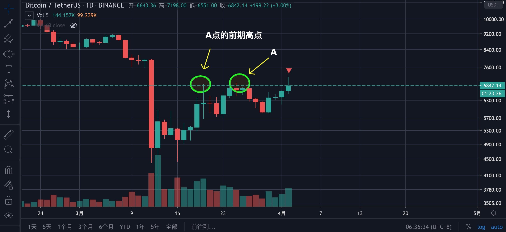

上图中，当价格运行至A时，前期高点就会A起到压制作用。

#### ②下降趋势中的fib回撤点位

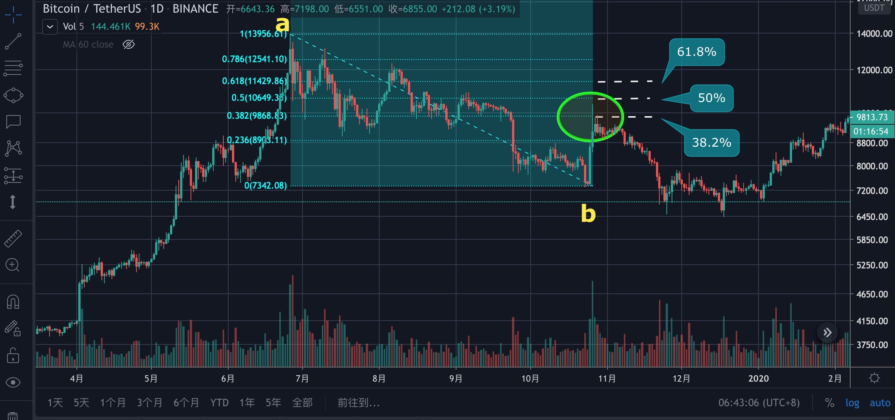

下降趋势中的斐波那契回撤点位**38.2%**、**50%**以及**61.8%**都可能形成压力。上图中，ab是一段上升趋势，b遇到了1025时间发生了暴涨，但在38.2%-50%区间被压制住，没有顺利突破61.8%的位置，行情没有被逆转，下跌仍将持续。

#### ③筹码密集区

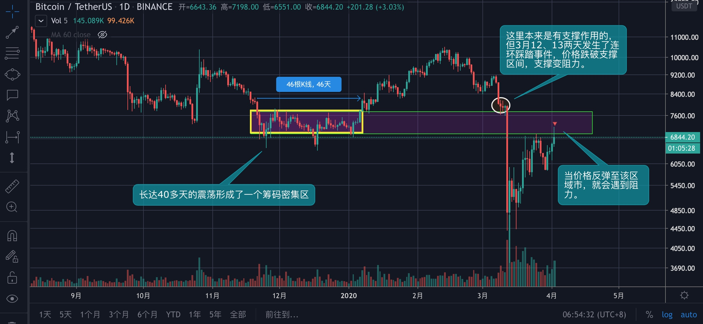

上图中，黄色趋势是长达40多天震荡形成的筹码密集区，后来价格跳出该区域向上突破，这里本来是有支撑作用的，但3月12、13号两天发生了连环踩踏事件，导致价格跌破支撑区域，支撑阻力，当价格反弹至这里时就会遇到阻力。

> 这是今天（2020年4月3日）的走势图，目前已经遇到了阻力，做短线的可以操作了。

#### ④趋势线

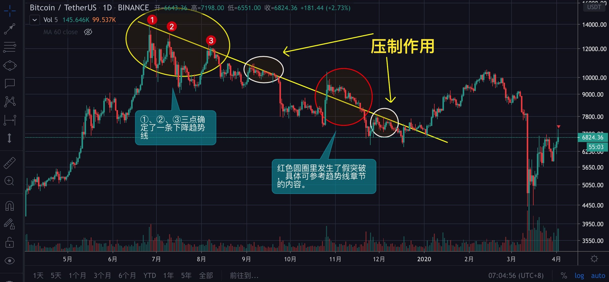

上图中，①、②、③三点确定了一条下降趋势线，每当反弹至趋势线附近就会遇到压制作用，红色圆圈中是假突破，具体请复习《[基础知识之趋势线篇](qushixian.md)》。

#### ⑤掉头向下的均线

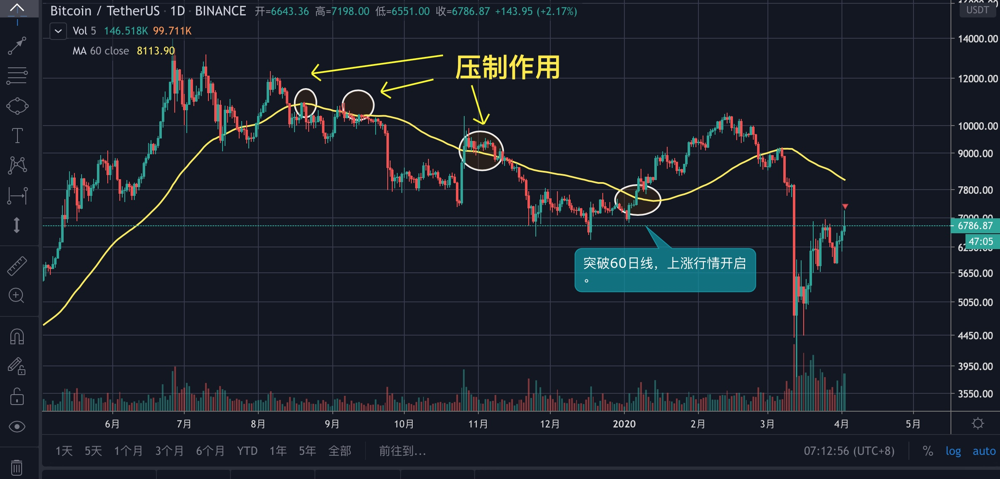

上图中，黄色的线是60日线，且已掉头向下，就会对价格起到压制作用，直到某一天成功的突破了这条线，行情才进入了上涨模式。如有有多条均线，离价格最近的那条最先起作用。

还记得吗

> 60日线对中期行情有着重大的参考意义，具体请复习《[基础知识之MA篇](maxian.md)》。

#### ⑥大阴线的上沿（起跌点）附近

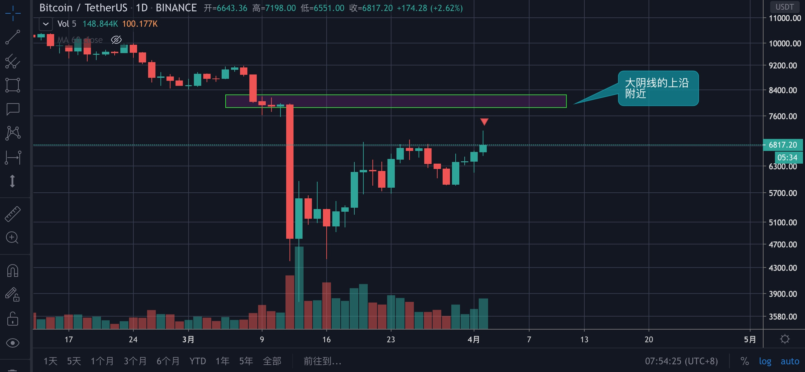

放量下跌的起始点附近可以视压力位。

也有人认为大阴线的（从下往上）1/3，1/2，2/3处也都有压力（对大阳线对应），用fib也可以解释，但我在实际运用中一般会将大阴线起跌点视为压力，当然，你也可以试试1/3，1/2.，2/3这些位置，只是我不常用。

## 如何用

顺势交易者，突破压力位做多，跌破支撑位做空；逆势交易者，到达压力位附近做空，到达支撑位附近做多。

## 需要记住的

* 牢记河宽与沽压带的用法
* 压力与支撑是一个区域
* 压力与支撑可以互换
* 只适用于BTC、ETH等大市值币种

