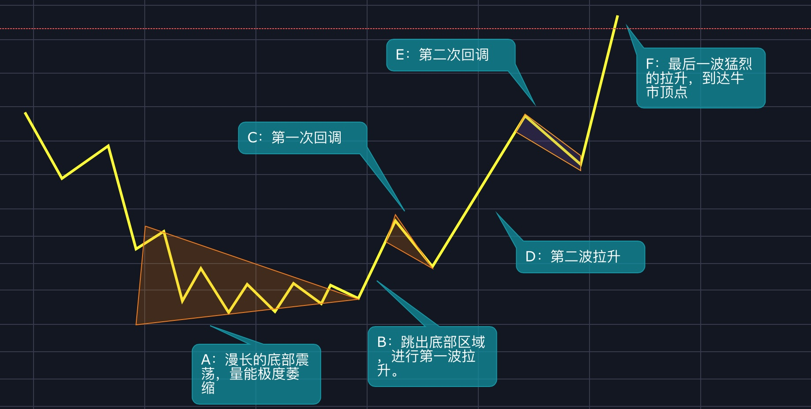
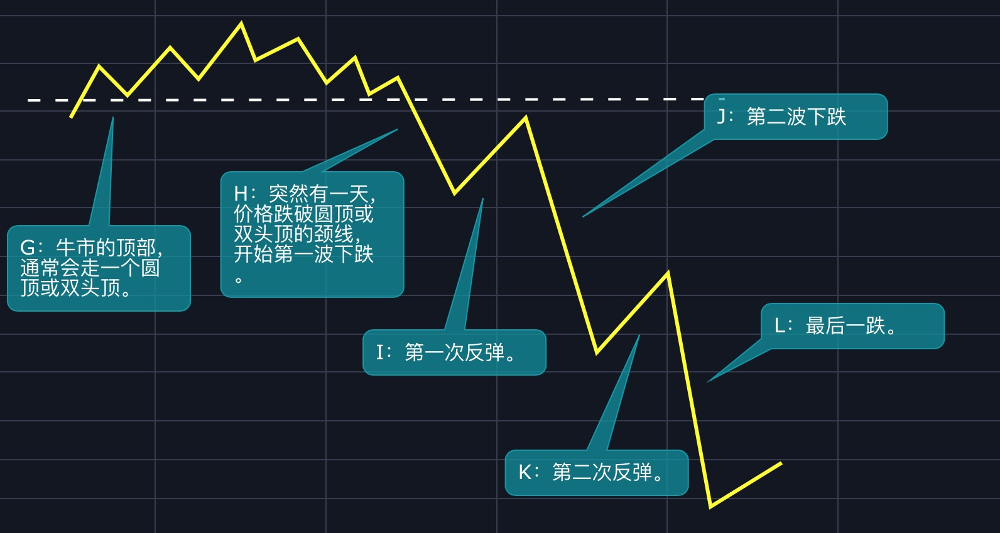
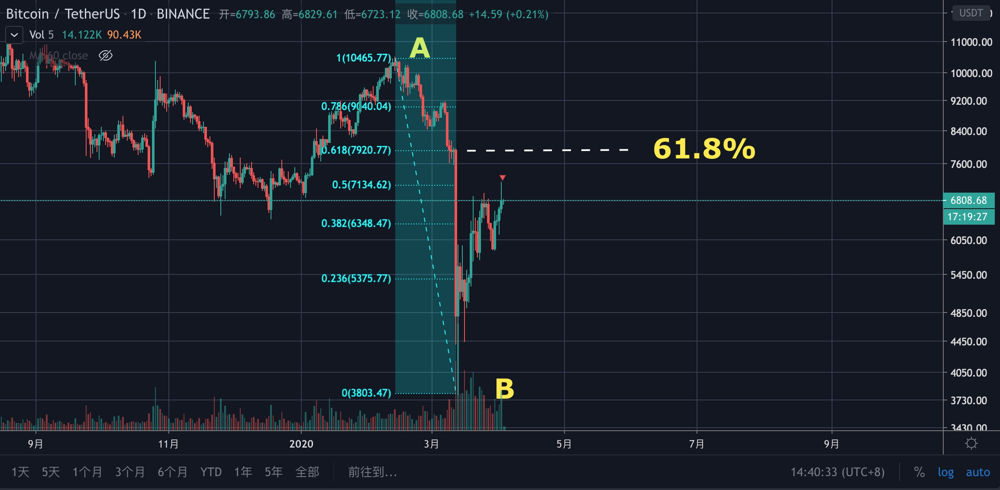
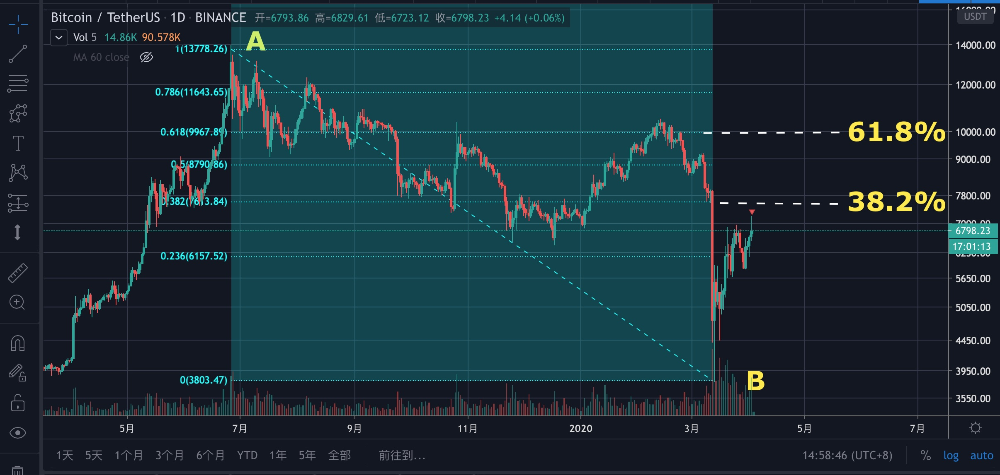

# 第八章：高级技术之牛熊周期

不知你有没有这种经历，如果BTC在短时间内暴涨了，你就会觉得牛市来了，于是忍不住的要买入，如果BTC在短时间内发生了大幅的下跌，就认为熊市来了，想赶快卖出，反正只要BTC一有大波动，你就会不知所措。

还有另外一种情况，明明是一段反弹趋势，你却将它看成牛市，结果该下车的时候不下车；明明是牛市中的回调，你却认为熊市要来了，于是提前下车……

总之，你只看到了树叶绿了黄黄了绿，却不懂春去冬已来，你只看到了BTC涨了跌跌了涨，却不知牛熊已更替。

为何会这样？因为你不懂牛熊周期。

## 牛熊周期

周期有很多种，有太阳黑子的活动周期、经济周期、信贷周期等，我们今天主要讲牛熊周期。

**那么什么是牛熊周期呢？简单的说，就是割韭菜周期。**

上图是熊市进入牛市图，我们来分析一下韭菜的心理变化。

* 阶段A：这时候市场已经熊很久了，交投清淡，量能极度萎缩，波动变得很小，韭菜们更是对这个市场失望透顶。
* 阶段B：突然有一天，波动开始增加，一根阳线将价格带离震荡区间，这时候韭菜们不会去追，_而是选择观望_，_**先看看是什么情况再说**_。
* 阶段C：到了阶段C，市场开启了第一次回调，由于韭菜们仍处于熊市思维中，他们看到回调就很开心，同时还为自己没有买入而感到庆幸——“_**幸好当初没有买入，现在的市场还处于熊市中啊！**_”
* 阶段D：然后呢，市场开启了第二波拉升，而且这次比第一次更猛，_**这时候韭菜们就有点焦虑了，他们会想，牛市这么快就来了吗？**_你看，虽然焦虑了，但仍然不肯相信牛市来了。
* 阶段E：恰好这时候市场开启了第二次回调，韭菜又开始高兴了——“_**哈哈，我就说嘛，市场一定会下跌的，熊市无疑了！**_”
* 阶段F：到了F阶段，市场开启了最猛烈的一波拉升，这时候韭菜们终于控制不住了，拼了命的往里冲！

上图是牛市进入熊市图，我们接着来分析。

* 阶段G：这里已经是牛市顶部了，市场再无更多的资金进入，主力也开始对筹码进行派发，而韭菜刚刚进来，还沉醉在发财的美梦中呢。
* 阶段H：突然有一天，市场开始了下跌，比如跌破颈线等关键支撑位，这时候有经验的交易员已经感觉牛市即将结束并开始对标的进行卖出操作了，可韭菜们却不这样想，他们在阶段F才进来，还没有发财呢，_**他们会觉得这只是个回调**_。
* 阶段I：到了阶段I，市场开始第一次反弹，这时候韭菜们又开始庆幸了——_**看吧，我就说前面是回调吧，幸亏之前没有卖出。**_
* 阶段J：这时候，更猛烈的下跌来了，韭菜们被跌懵了——**说好的牛市呢？怎么能跌这么久**？请注意，由于人都是有**处置效应**的，即使跌了，也有大量韭菜不会进行卖出操作。
* 阶段K：到了阶段K，市场终于又反弹了，这时候韭菜们又开始幻想牛市了。
* 阶段L：现在市场终于等来了最后一跌，遗憾的是，这时候韭菜们再也坚持不住了，他们看到这么猛烈的下跌，就会对这个市场彻底失望，最后割肉离开。

以上就是牛熊周期各个阶段韭菜们的心理变化，你看，这个市场总在不停地进行着牛熊交替，但每一次牛熊，都是一部韭菜的血泪史！

现在你理解了牛熊周期，那怎么识别牛熊周期呢？

## 识别牛熊周期

其实很简单，你只要找到最近的低点与高点，然后使用斐波那契回撤工具测量一下就搞定了，下面我们用实例说明。

> 如上图，A到B是一波下降趋势，现在我们要确认的是，相对于A——B这段下跌趋势而言，目前市场走开始牛了吗？
>
> 我们从A到B画一条fib线，从fib上可以看出，618%在8000附近，而现在的价格是6800，因此，我们就可以确认，目前市场并没有走牛，何时走牛呢？只有价格突破了8000，才能说明从A点下来的这波下跌趋势被逆转了。

是不是很简单呢？

但是，我要告诉你的是，这只是相对小的周期，还有更大周期。

上图仍然是BTC的走势图，只时将A点从10500点移到了14000点（19年6月的高点），现在看，依然处于熊市中，而且是更熊，因为现在的61.8%在10000附近，也就是说，只有突破了10000点，才能说明从14000点下跌至今的这波趋势被逆转了。

需要注意的是，如果我们不做那么长的线，就不用看太大的周期，因为周期越大，市场越迟钝，就越容易“踏空”。比如我现在做中长线，只需要参考第一张图即可。

注：此处的牛熊周期并非BTC 4年一牛熊的那个大周期。

## 需要知道的

* 虽然我不喜欢用“韭菜”称呼那些投资小白，但却也找不出更好的词来形容，索性就用了。
* 大周期包含小周期，小周期又组成了大周期。比如一小时的周期组成一天的，一天的周期组成一年的，总之，再小的时间段也是有周期的。
* 道理很简单，可大多数人就是逃脱不了韭菜的命运。

